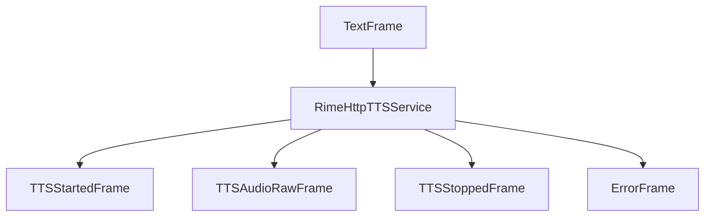

## Overview

`RimeHttpTTSService` provides text-to-speech capabilities using Rime AI's TTS service. It supports streaming audio output and various speech customization options.

<Tip>
  You can obtain a Rime API key by signing up at [Rime](https://rime.ai/signup).
</Tip>

## Configuration

### Constructor Parameters

<ParamField path="api_key" type="str" required>
  Rime API key
</ParamField>

<ParamField path="voice_id" type="str" default="eva">
  Rime voice identifier. See [Rime's
  documentation](https://rimelabs.mintlify.app/api-reference/voices) for
  supported voices.
</ParamField>

<ParamField path="model" type="str" default="mist">
  Choose `mist` for hyper-realistic conversational voices or `v1` for Rime’s
  first-gen model.
</ParamField>

<ParamField path="sample_rate" type="int" default="24000">
  The value, if provided, must be between 4000 and 44100. Default: 24000
</ParamField>

<ParamField path="params" type="InputParams" default="InputParams()">
  Speech generation parameters
  <Expandable title="properties">
    <ParamField path="pause_between_brackets" type="bool" default="false">
      When set to `true`, adds pauses between words enclosed in angle brackets. The number inside the brackets specifies the pause duration in milliseconds.
      
      Example: `“Hi. <200> I’d love to have a conversation with you.”` adds a 200ms pause between the first and second sentences.
    </ParamField>

    <ParamField path="phonemize_between_brackets" type="bool" default="false">
      When set to true, you can specify the phonemes for a word enclosed in curly brackets.

      Example: `“{h’El.o} World” will pronounce “Hello”` as expected. See [Rime's docs](https://rimelabs.mintlify.app/api-reference/endpoint/streaming-pcm) for more details.
    </ParamField>

    <ParamField path="inline_speed_alpha" type="str" default="None">
      Comma-separated list of speed values applied to words in square brackets. Values < 1.0 speed up speech, > 1.0 slow it down. Example: `“This sentence is [really] [fast]”` with `inline_speed_alpha` set to `“0.5, 3”` will make “really” slow and “fast” fast.
    </ParamField>

    <ParamField path="speed_alpha" type="float" default="1.0">
      Adjusts the speed of speech. Lower than 1.0 is faster than default. Higher than 1.0 is slower than default.
    </ParamField>

    <ParamField path="reduce_latency" type="bool" default="false">
      Reduces the latency of response, at the cost of some possible mispronunciation of digits and abbreviations.
    </ParamField>

  </Expandable>
</ParamField>

## Output Frames

### Control Frames

<ParamField path="TTSStartedFrame" type="Frame">
  Signals start of speech synthesis
</ParamField>

<ParamField path="TTSStoppedFrame" type="Frame">
  Signals completion of speech synthesis
</ParamField>

### Audio Frames

<ParamField path="TTSAudioRawFrame" type="Frame">
  Contains generated audio data with: - PCM audio format - Specified sample rate
  - Single channel (mono)
</ParamField>

### Error Frames

<ParamField path="ErrorFrame" type="Frame">
  Contains Rime TTS error information
</ParamField>

## Usage Example

```python
from pipecat.services.rime import RimeHttpTTSService

# Configure service
tts_service = RimeHttpTTSService(
    api_key="your-rime-api-key",
    voice_id="eva",
    model="mist",
    params=RimeHttpTTSService.InputParams(
        speed_alpha=1.2,
        reduce_latency=True
    )
)

# Use in pipeline
pipeline = Pipeline([
    text_input,         # Produces text
    tts_service,        # Converts text to speech
    audio_output        # Plays audio
])
```

## Frame Flow



## Metrics Support

The service collects processing metrics:

- Time to First Byte (TTFB)
- Character usage statistics

## Notes

- Supports streaming audio output
- Configurable speech speed
- Latency optimization options
- Bracket-based text processing
- Thread-safe processing
- Automatic error handling
- Chunked audio delivery
