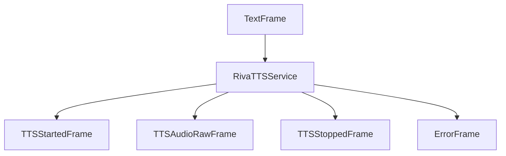

## Overview

`RivaTTSService` converts text to speech using NVIDIA's Riva. It provides high-quality text-to-speech synthesis with configurable voice options, including multilingual voices.

## Installation

To use `RivaTTSService`, install the required dependencies:

```bash
pip install "pipecat-ai[riva]"
```

You'll also need to set up your NVIDIA API key as an environment variable: `NVIDIA_API_KEY`

## Configuration

### Constructor Parameters

<ParamField path="api_key" type="str" required>
  Your NVIDIA API key
</ParamField>

<ParamField path="server" type="str" default="grpc.nvcf.nvidia.com:443">
  NVIDIA Riva server address
</ParamField>

<ParamField path="voice_id" type="str" default="Magpie-Multilingual.EN-US.Ray">
  Voice identifier to use for synthesis
</ParamField>

<ParamField path="sample_rate" type="int" default="None">
  Output audio sample rate in Hz
</ParamField>

<ParamField
  path="model_function_map"
  type="Mapping [str, str]"
  default='{
    "function_id": "877104f7-e885-42b9-8de8-f6e4c6303969",
    "model_name": "magpie-tts-multilingual",
  }'
>
  A mapping of the NVIDIA function identifier for the TTS service with the model name.
</ParamField>

<ParamField path="params" type="InputParams" default="InputParams()">
  Additional configuration parameters (language and quality)
</ParamField>

### InputParams

<ParamField path="language" type="Language" default="Language.EN_US">
  The language for TTS generation
</ParamField>

<ParamField path="quality" type="int" default="20">
  Quality level for the generated audio
</ParamField>

## Input

The service accepts text input through its TTS pipeline.

## Output Frames

### TTSStartedFrame

Signals the start of audio generation.

### TTSAudioRawFrame

Contains generated audio data:

<ParamField path="audio" type="bytes">
  Raw audio data chunk
</ParamField>

<ParamField path="sample_rate" type="int">
  Audio sample rate
</ParamField>

<ParamField path="num_channels" type="int">
  Number of audio channels (1 for mono)
</ParamField>

### TTSStoppedFrame

Signals the completion of audio generation.

## Methods

See the [TTS base class methods](/server/base-classes/speech#ttsservice) for additional functionality.

## Models

| Model                     | Model Card Link                                                                        |    
| ------------------------- | -------------------------------------------------------------------------------------- |
| `magpie-tts-multilingual` | [NVIDIA Model Card](https://build.nvidia.com/nvidia/magpie-tts-multilingual/modelcard) |
| `fastpitch-hifigan-tts`   | [NVIDIA Model Card](https://build.nvidia.com/nvidia/fastpitch-hifigan-tts/modelcard)   |

## Language Support

Riva model `magpie-tts-multilingual` (default) supports English, Spanish, and French:

| Language Code    | Description     | Service Codes |
| ---------------- | --------------- | ------------- |
| `Language.EN_US` | English (US)    | `en-US`       |
| `Language.ES-US` | Spanish (US)    | `es-US`       |
| `Language.FR-FR` | French (France) | `fr-FR`       |

## Usage Examples

### TTS Language and Voice Configuration

```python
from pipecat.services.riva.tts import RivaTTSService
from pipecat.transcriptions.language import Language

# Configure service
tts = RivaTTSService(
    api_key="your-nvidia-api-key",
    voice_id="Magpie-Multilingual.FR-FR.Louise",
    params=RivaTTSService.InputParams(
        language=Language.FR_FR,
        quality=20
    )
)

# Use in pipeline
pipeline = Pipeline([
    ...,
    llm,
    tts,
    transport.output(),
])
```

### Model, function ID, and Voice configuration

```python
# Configure TTS with specific language
tts = RivaTTSService(
    api_key="your-nvidia-api-key",
    voice_id="English-US.Female-1",
    model_function_map={
      "function_id": "0149dedb-2be8-4195-b9a0-e57e0e14f972",
      "model_name": "fastpitch-hifigan-tts",
    }
)

# Use in pipeline
pipeline = Pipeline([
    ...,
    llm,
    tts,
    transport.output(),
])
```

## Frame Flow



## Metrics Support

The service supports metrics collection:

- Time to First Byte (TTFB)
- TTS usage metrics
- Processing duration

## Audio Processing

- Processes audio through the Riva API
- Generates mono audio output
- Handles asynchronous audio streaming
- Configurable sampling rate

## Notes

- Uses NVIDIA's Riva AI Services platform
- Streams audio in chunks
- Requires valid NVIDIA API key
- Thread-safe processing with asyncio
