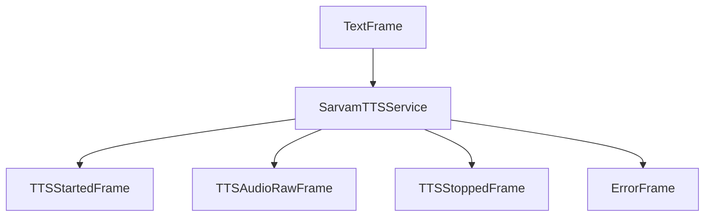

## Overview

`SarvamTTSService` converts text to speech using Sarvam AI's TTS API. It specializes in Indian languages and provides extensive voice customization options including pitch, pace, and loudness control.

## Installation

To use `SarvamTTSService`, no additional dependencies are required.

You'll also need to set up your Sarvam AI API key as an environment variable: `SARVAM_API_KEY`

## Configuration

### Constructor Parameters

<ParamField path="api_key" type="str" required>
  Your Sarvam AI API subscription key
</ParamField>

<ParamField path="voice_id" type="str" default="anushka">
  Speaker voice identifier (e.g., "anushka", "meera", "abhilash")
</ParamField>

<ParamField path="model" type="str" default="bulbul:v2">
  TTS model to use ("bulbul:v1" or "bulbul:v2")
</ParamField>

<ParamField path="aiohttp_session" type="aiohttp.ClientSession" required>
  Shared aiohttp session for making HTTP requests
</ParamField>

<ParamField path="base_url" type="str" default="https://api.sarvam.ai">
  Sarvam AI API base URL
</ParamField>

<ParamField path="sample_rate" type="int" default="None">
  Audio sample rate in Hz (8000, 16000, 22050, 24000)
</ParamField>

<ParamField path="params" type="InputParams" default="None">
  Additional voice and preprocessing parameters
</ParamField>

### InputParams Configuration

<ParamField path="language" type="Language" default="Language.HI">
  Target language for synthesis
</ParamField>

<ParamField path="pitch" type="float" default="0.0">
  Voice pitch adjustment (-0.75 to 0.75)
</ParamField>

<ParamField path="pace" type="float" default="1.0">
  Speech speed (0.3 to 3.0)
</ParamField>

<ParamField path="loudness" type="float" default="1.0">
  Audio volume (0.1 to 3.0)
</ParamField>

<ParamField path="enable_preprocessing" type="bool" default="False">
  Enable text normalization for mixed-language content
</ParamField>

## Input

The service accepts text input through its TTS pipeline with automatic WAV header stripping for clean PCM output.

## Output Frames

### TTSStartedFrame

Signals the start of audio generation.

### TTSAudioRawFrame

Contains generated audio data:

<ParamField path="audio" type="bytes">
  Raw PCM audio data (WAV header stripped)
</ParamField>

<ParamField path="sample_rate" type="int">
  Audio sample rate (22050Hz default)
</ParamField>

<ParamField path="num_channels" type="int">
  Number of audio channels (1 for mono)
</ParamField>

### TTSStoppedFrame

Signals the completion of audio generation.

## Methods

See the [TTS base class methods](/server/base-classes/speech#ttsservice) for additional functionality.

## Language Support

Sarvam AI TTS supports the following Indian languages:

| Language Code | Description     | Service Code |
| ------------- | --------------- | ------------ |
| `Language.BN` | Bengali         | `bn-IN`      |
| `Language.EN` | English (India) | `en-IN`      |
| `Language.GU` | Gujarati        | `gu-IN`      |
| `Language.HI` | Hindi           | `hi-IN`      |
| `Language.KN` | Kannada         | `kn-IN`      |
| `Language.ML` | Malayalam       | `ml-IN`      |
| `Language.MR` | Marathi         | `mr-IN`      |
| `Language.OR` | Odia            | `od-IN`      |
| `Language.PA` | Punjabi         | `pa-IN`      |
| `Language.TA` | Tamil           | `ta-IN`      |
| `Language.TE` | Telugu          | `te-IN`      |

## Voice Models

See the [Sarvam docs](https://docs.sarvam.ai/api-reference-docs/text-to-speech/convert#request.body.speaker) for the latest information on available voices and models.

## Usage Example

```python
from pipecat.services.sarvam.tts import SarvamTTSService
from pipecat.transcriptions.language import Language
import aiohttp

# Configure service
async with aiohttp.ClientSession() as session:
    tts = SarvamTTSService(
        api_key="your-api-key",
        voice_id="anushka",
        model="bulbul:v2",
        aiohttp_session=session,
        params=SarvamTTSService.InputParams(
            language=Language.HI,
        )
    )

    # Use in pipeline
    pipeline = Pipeline([
        ...,
        llm,
        tts,
        transport.output(),
    ])
```

## Frame Flow



## Metrics Support

The service supports metrics collection:

- Time to First Byte (TTFB)
- TTS usage metrics
- Processing duration

## Audio Processing

- Returns base64-encoded WAV audio from API
- Supports multiple sample rates (8000, 16000, 22050, 24000 Hz)
- Generates mono audio output
- Handles HTTP-based synthesis

## Notes

- Requires valid Sarvam AI API subscription key
- Specializes in Indian languages and voices
- Uses HTTP POST requests for synthesis
- Thread-safe HTTP session management required
