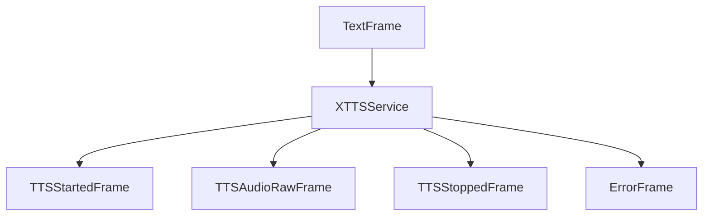

<Warning>
  Coqui, the XTTS maintainer, has shut down. XTTS may not receive future updates
  or support.
</Warning>

## Overview

`XTTSService` provides text-to-speech capabilities using [Coqui's XTTS](https://huggingface.co/coqui/XTTS-v2) (Cross-lingual Text-to-Speech) model through a streaming server. It supports multiple languages and custom voice cloning.

## Installation

The service requires a running XTTS streaming server. You can start one using Docker:

```bash
docker run --gpus=all -e COQUI_TOS_AGREED=1 --rm -p 8000:80 ghcr.io/coqui-ai/xtts-streaming-server:latest-cuda121
```

For more information, visit the [official repository](https://github.com/coqui-ai/xtts-streaming-server).

## Configuration

### Constructor Parameters

<ParamField path="voice_id" type="str" required>
  Voice identifier from studio speakers
</ParamField>

<ParamField path="language" type="Language" required>
  Language for speech synthesis
</ParamField>

<ParamField path="base_url" type="str" required>
  XTTS streaming server URL
</ParamField>

<ParamField path="aiohttp_session" type="aiohttp.ClientSession" required>
  HTTP client session for API requests
</ParamField>

<ParamField path="sample_rate" type="int" default="24000">
  Output audio sample rate in Hz
</ParamField>

<ParamField path="text_filter" type="BaseTextFilter" default="None">
  Modifies text provided to the TTS. [Learn
  more](/server/base-classes/text#text-filters) about the available filters.
</ParamField>

## Output Frames

### Control Frames

<ParamField path="TTSStartedFrame" type="Frame">
  Signals start of speech synthesis
</ParamField>

<ParamField path="TTSStoppedFrame" type="Frame">
  Signals completion of speech synthesis
</ParamField>

### Audio Frames

<ParamField path="TTSAudioRawFrame" type="Frame">
  Contains generated audio data with: - PCM audio format - Specified sample rate
  (resampled from 24kHz) - Single channel (mono)
</ParamField>

### Error Frames

<ParamField path="ErrorFrame" type="Frame">
  Contains XTTS server error information
</ParamField>

## Methods

See the [TTS base class methods](/server/base-classes/speech#ttsservice) for additional functionality.

## Language Support

Supports multiple languages:

| Language Code | Description          | Service Code |
| ------------- | -------------------- | ------------ |
| `Language.CS` | Czech                | `cs`         |
| `Language.DE` | German               | `de`         |
| `Language.EN` | English              | `en`         |
| `Language.ES` | Spanish              | `es`         |
| `Language.FR` | French               | `fr`         |
| `Language.HI` | Hindi                | `hi`         |
| `Language.HU` | Hungarian            | `hu`         |
| `Language.IT` | Italian              | `it`         |
| `Language.JA` | Japanese             | `ja`         |
| `Language.KO` | Korean               | `ko`         |
| `Language.NL` | Dutch                | `nl`         |
| `Language.PL` | Polish               | `pl`         |
| `Language.PT` | Portuguese           | `pt`         |
| `Language.RU` | Russian              | `ru`         |
| `Language.TR` | Turkish              | `tr`         |
| `Language.ZH` | Chinese (Simplified) | `zh-cn`      |

## Usage Example

```python
from pipecat.services.xtts import XTTSService
from pipecat.transcriptions.language import Language
import aiohttp

# Configure service
async with aiohttp.ClientSession() as session:
    tts_service = XTTSService(
        voice_id="speaker_1",
        language=Language.EN,
        base_url="http://localhost:8000",
        aiohttp_session=session
    )

    # Use in pipeline
    pipeline = Pipeline([
        ...,
        llm,
        tts,
        transport.output(),
    ])
```

## Streaming Process

The service handles audio streaming in chunks:

1. Receives audio chunks from XTTS server
2. Buffers chunks for processing
3. Resamples audio to desired sample rate
4. Delivers audio frames in real-time

```python
# Streaming configuration
payload = {
    "text": text,
    "language": language_code,
    "speaker_embedding": embeddings,
    "gpt_cond_latent": latent_data,
    "add_wav_header": False,
    "stream_chunk_size": 20
}
```

## Frame Flow



## Metrics Support

The service collects processing metrics:

- Time to First Byte (TTFB)
- Processing duration
- Character usage
- Streaming performance

## Notes

- Requires GPU for optimal performance
- Supports real-time streaming
- Automatic audio resampling
- Buffer management for smooth playback
- Thread-safe processing
- Automatic error handling
- Manages server connection lifecycle
- Text preprocessing (removes periods and asterisks)
