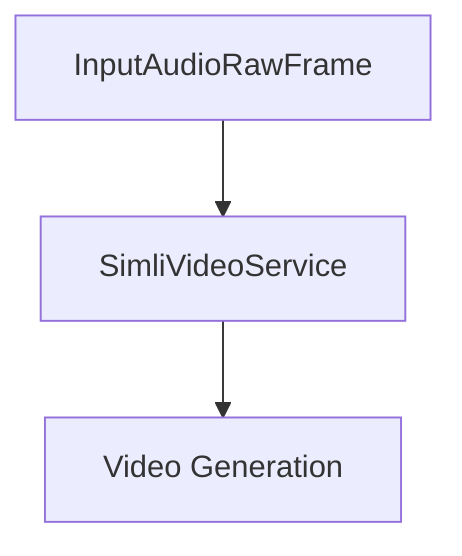

## Overview

`SimliVideoService` creates AI avatar video responses by converting audio input into synchronized video and audio output through Simli's WebRTC platform. It handles real-time audio streaming, video generation, and automatic audio resampling.

## Installation

Install the required dependencies:

```bash
pip install pipecat-ai[simli]
```

## Configuration

### Required Environment Variables

```bash
SIMLI_API_KEY=your_api_key
SIMLI_FACE_ID=your_face_id
```

<Tip>
  Get your API key and Face ID by signing up at [Simli](https://www.simli.com/)
</Tip>
## Configuration

```python
SimliVideoService(
    SimliConfig(SIMLI_API_KEY, SIMLI_FACE_ID), useTurnServer=False, latencyInterval=60
)
```

### Constructor Parameters for `SimliConfig`

<ParamField path="apiKey" type="str" required>
  Your Simli API key. This key is required for authenticating API requests.
</ParamField>

<ParamField path="faceId" type="str" required>
  The face identifier for Simli. This is used to associate API interactions with
  a specific face or persona.
</ParamField>

<ParamField path="syncAudio" type="bool" default="True">
  Indicates whether to synchronize audio streams. Defaults to `True`. Set to
  `False` to disable audio synchronization.
</ParamField>

<ParamField path="handleSilence" type="bool" default="True">
  Determines if silence in audio streams should be handled automatically.
  Defaults to `True`.
</ParamField>

<ParamField path="maxSessionLength" type="int" default="600">
  The maximum length of a session in seconds. Defaults to `600` (10 minutes).
</ParamField>

<ParamField path="maxIdleTime" type="int" default="30">
  The maximum idle time (in seconds) allowed during a session before it is
  automatically terminated. Defaults to `30` seconds.
</ParamField>

### Constructor Parameters for `SimliVideoService`

<ParamField path="simli_config" type="SimliConfig" required>
  The configuration object for Simli. This must be an instance of `simli_config`
  and contains essential settings such as API key, face ID, and other
  session-related configurations.
</ParamField>

<ParamField path="use_turn_server" type="bool" default="False">
  Determines whether a TURN server should be used for establishing connections.
  Defaults to `False`. Set to `True` if your network requires TURN for WebRTC
  connections.
</ParamField>

<ParamField path="latency_interval" type="int" default="0">
  Delay (in seconds) between ping calls to calculate latency between your
  machine and simli server. Set to `0` to disable.
</ParamField>

## Input Frames

### Audio Input

<ParamField path="TTSAudioRawFrame" type="Frame">
  Raw audio data for avatar speech
</ParamField>

### Control Frames

<ParamField path="TTSStartedFrame" type="Frame">
  Signals start of speech synthesis
</ParamField>

<ParamField path="TTSStoppedFrame" type="Frame">
  Signals end of speech synthesis
</ParamField>

<ParamField path="StartInterruptionFrame" type="Frame">
  Signals conversation interruption
</ParamField>

<ParamField path="EndFrame" type="Frame">
  Signals end of conversation
</ParamField>

<ParamField path="CancelFrame" type="Frame">
  Signals conversation cancellation
</ParamField>

## Usage Example

```python
from pipecat.pipeline.pipeline import Pipeline
from pipecat.services.simli import SimliVideoService
from simli import SimliConfig
import os

async def create_avatar_pipeline():
    # Initialize Simli service
    simli = SimliVideoService(
        SimliConfig(
            api_key=os.getenv("SIMLI_API_KEY"),
            face_id=os.getenv("SIMLI_FACE_ID")
        )
    )

    # Create pipeline with Simli
    pipeline = Pipeline([
        transport.input(),    # Your audio input
        llm,                  # Language model service
        tts_service,          # Text-to-speech service
        simli,                # Simli video generation
        transport.output(),   # Your video output handler
    ])

    return pipeline
```

## Frame Flow



## Metrics Support

The service collects processing metrics:

- Processing duration
- Time to First Byte (TTFB)
- API response times
- Audio processing metrics

## Common Use Cases

1. **AI Video Avatars**

   - Virtual assistants
   - Customer service
   - Educational content

2. **Interactive Presentations**

   - Product demonstrations
   - Training materials
   - Marketing content

3. **Real-time Communication**
   - Video conferencing
   - Virtual meetings
   - Interactive broadcasts

## Notes

- Handles real-time audio streaming
- Supports conversation interruptions
- Manages conversation lifecycle
- Automatic audio resampling
- Thread-safe processing
- WebRTC integration through [Daily](/server/services/transport/daily)
- Includes comprehensive error handling
