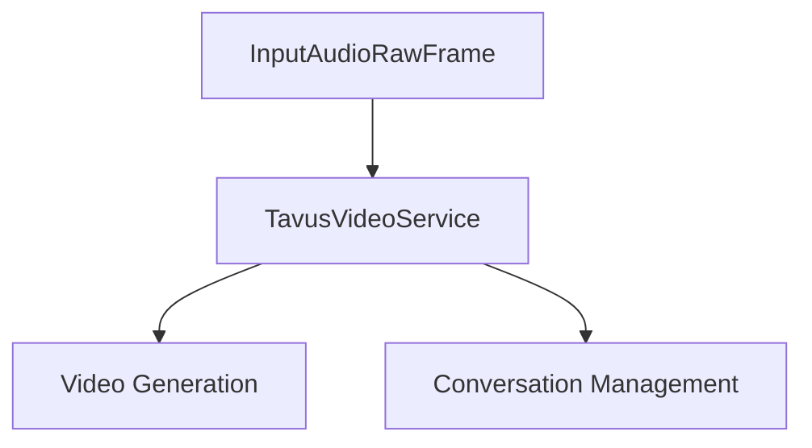

## Overview

Pipecat integrates with [Tavus](https://tavus.io) to support AI-generated video avatars. The integration includes:

- `TavusVideoService` – a pipeline service that handles audio streaming and requests Tavus to generate avatar video responses.
- `TavusTransport` – a transport layer that directly streams generated Tavus video to users in real-time. All the details [here](/server/services/transport/tavus)

For full integration details, visit [Tavus + Pipecat Docs](https://docs.tavus.io/sections/integrations/pipecat#pipecat).

---

## Installation

Install the Tavus integration for Pipecat:

```bash
pip install "pipecat-ai[tavus]"
```

Set the following environment variables:

- `TAVUS_API_KEY` – Your Tavus API key
- `TAVUS_REPLICA_ID` – Tavus replica identifier
- (Optional) `TAVUS_PERSONA_ID` – Persona ID for video generation

Sign up to get your API key at [Tavus](https://platform.tavus.io/auth/sign-up?plan=free).

---

## TavusVideoService

### Purpose

Handles real-time audio and coordinates Tavus avatar video generation.

### Constructor Parameters

<ParamField path="api_key" type="str" required>
  Tavus API key
</ParamField>

<ParamField path="replica_id" type="str" required>
  Tavus replica identifier
</ParamField>

<ParamField path="persona_id" type="str" default="pipecat-stream">
  Optional persona ID (default is `pipecat-stream`)
</ParamField>

<ParamField path="session" type="aiohttp.ClientSession" required>
  HTTP client session for API communication
</ParamField>

### Input Frames

#### Audio Input

<ParamField path="TTSAudioRawFrame" type="Frame">
  Raw audio data for avatar speech
</ParamField>

#### Control Frames

<ParamField path="StartInterruptionFrame" type="Frame">
  Signals conversation interruption
</ParamField>

<ParamField path="EndFrame" type="Frame">
  Signals end of conversation
</ParamField>

<ParamField path="CancelFrame" type="Frame">
  Signals conversation cancellation
</ParamField>

## Usage Example

```python
from pipecat.services.tavus.video import TavusVideoService
import aiohttp

async with aiohttp.ClientSession() as session:
    # Configure service
    tavus = TavusVideoService(
        api_key=os.getenv("TAVUS_API_KEY"),
        replica_id=os.getenv("TAVUS_REPLICA_ID"),
        session=session,
    )

    # Use in pipeline
    pipeline = Pipeline(
        [
            transport.input(),                # Transport user input
            stt,                              # STT
            context_aggregator.user(),        # User responses
            llm,                              # LLM
            tts,                              # TTS
            tavus,                            # Tavus output layer
            transport.output(),               # Transport bot output
            context_aggregator.assistant(),   # Assistant spoken responses
        ]
    )
```

---

## Frame Flow



## Metrics Support

The service collects processing metrics:

- Processing duration
- Time to First Byte (TTFB)
- API response times
- Audio processing metrics

## Common Use Cases

1. **AI Video Avatars**

   - Virtual assistants
   - Customer service
   - Educational content

2. **Interactive Presentations**

   - Product demonstrations
   - Training materials
   - Marketing content

3. **Real-time Communication**
   - Video conferencing
   - Virtual meetings
   - Interactive broadcasts

## Notes

- Handles real-time audio streaming
- Supports conversation interruptions
- Manages conversation lifecycle
- Automatic audio resampling
- Thread-safe processing
- Includes comprehensive error handling
