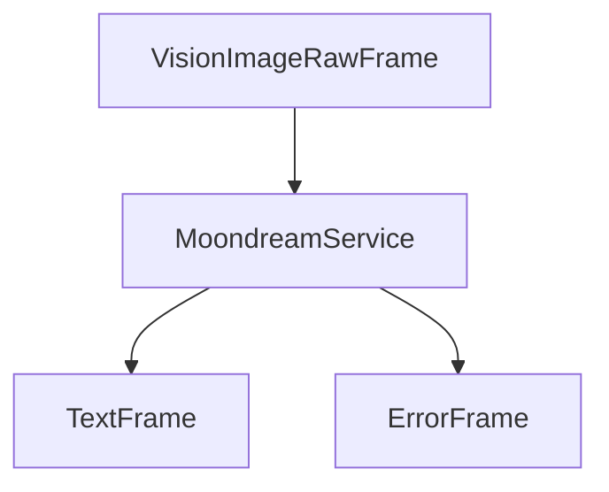

## Overview

`MoondreamService` provides local image analysis and question-answering capabilities using the Moondream model. It runs entirely on your local machine, supporting various hardware acceleration options including CUDA, Intel XPU, and Apple MPS.

## Installation

To use `MoondreamService`, install the required dependencies:

```bash
pip install pipecat-ai[moondream]
```

<Tip>
  You can obtain a Moondream API key by signing up at
  [Moondream](https://www.moondream.ai/).
</Tip>

## Configuration

### Constructor Parameters

<ParamField path="model" type="str" default="vikhyatk/moondream2">
  Hugging Face model identifier
</ParamField>

<ParamField path="revision" type="str" default="2024-08-26">
  Model revision/version
</ParamField>

<ParamField path="use_cpu" type="bool" default="False">
  Force CPU usage instead of available accelerators
</ParamField>

### Hardware Acceleration

The service automatically detects and uses the best available hardware:

1. Intel XPU (if intel_extension_for_pytorch is installed)
2. NVIDIA CUDA
3. Apple Metal (MPS)
4. CPU (fallback)

## Input

### VisionImageRawFrame

<ParamField path="format" type="str">
  Image format (e.g., 'RGB', 'RGBA')
</ParamField>

<ParamField path="size" type="tuple">
  Image dimensions (width, height)
</ParamField>

<ParamField path="image" type="bytes">
  Raw image data
</ParamField>

<ParamField path="text" type="str">
  Question about the image
</ParamField>

## Output Frames

### TextFrame

<ParamField path="text" type="str">
  Generated description or answer about the image
</ParamField>

### ErrorFrame

<ParamField path="error" type="str">
  Error information if processing fails
</ParamField>

## Methods

See the [Vision base class methods](/server/base-classes/media#visionservice) for additional functionality.

## Usage Example

```python
from pipecat.services.moondream import MoondreamService
from pipecat.frames.frames import VisionImageRawFrame
from PIL import Image

# Configure service
service = MoondreamService(
    model="vikhyatk/moondream2",
    revision="2024-08-26"
)

# Create pipeline
pipeline = Pipeline([
    image_input,      # Produces VisionImageRawFrame
    service,          # Analyzes images
    text_handler      # Handles text responses
])

# Example frame processing
image = Image.open("example.jpg")
frame = VisionImageRawFrame(
    format=image.mode,
    size=image.size,
    image=image.tobytes(),
    text="What objects are in this image?"
)
```

## Hardware Configuration Examples

### CUDA (NVIDIA GPU)

```python
# Automatically uses CUDA if available
service = MoondreamService()
```

### Intel XPU

```python
# Requires intel_extension_for_pytorch
import intel_extension_for_pytorch
service = MoondreamService()
```

### Force CPU Usage

```python
service = MoondreamService(use_cpu=True)
```

## Frame Flow



## Metrics Support

The service collects processing metrics:

- Processing duration
- Model loading time
- Inference time

## Performance Considerations

### Memory Usage

- Model size varies by version
- GPU memory requirements depend on image size
- CPU mode uses more system memory

### Processing Speed

Relative performance by hardware:

1. NVIDIA GPU (fastest)
2. Intel XPU
3. Apple MPS
4. CPU (slowest)

## Best Practices

### 1. Image Preparation

```python
# Optimize image before processing
def prepare_image(image_path):
    image = Image.open(image_path)
    # Resize if needed
    if max(image.size) > 1024:
        image.thumbnail((1024, 1024))
    return image
```

### 2. Error Handling

```python
try:
    async for frame in service.run_vision(vision_frame):
        if isinstance(frame, ErrorFrame):
            logger.error(f"Vision processing error: {frame.error}")
        elif isinstance(frame, TextFrame):
            process_result(frame.text)
except Exception as e:
    logger.error(f"Unexpected error: {e}")
```

### 3. Resource Management

```python
# Initialize once, reuse for multiple images
service = MoondreamService()
try:
    # Process multiple images
    for image in images:
        await process_image(service, image)
finally:
    # Cleanup if needed
    await service.cleanup()
```

## Notes

- Runs completely offline after model download
- First run requires model download
- Supports multiple hardware acceleration options
- Thread-safe processing
- Automatic error handling
- Manages model lifecycle
- Supports various image formats
