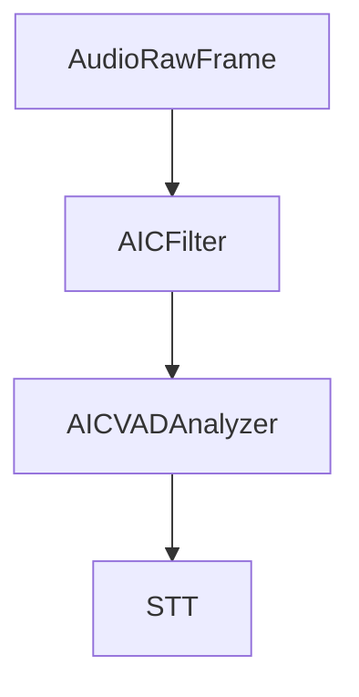

## Overview

`AICFilter` is an audio processor that enhances user speech by reducing background noise and improving speech clarity. It inherits from `BaseAudioFilter` and processes audio frames in real-time using ai-coustics' speech enhancement technology.

To use AIC, you need a license key. Get started at [ai-coustics.com](https://ai-coustics.com/pipecat).

<Note>
  This documentation covers **aic-sdk v2.x**. If you're using aic-sdk v1.x, please upgrade to v2 first. See the [Python 1.3 to 2.0 Migration Guide](https://docs.ai-coustics.com/guides/migrations/python-1-3-to-2-0#quick-migration-checklist) for details on API changes.
</Note>

## Installation

The AIC filter requires additional dependencies:

```bash
pip install "pipecat-ai[aic]"
```

## Constructor Parameters

<ParamField path="license_key" type="str" default="">
  ai-coustics license key for authentication. Get your key at [developers.ai-coustics.io](https://developers.ai-coustics.io).
</ParamField>

<ParamField path="model_id" type="str" default="None">
  Model identifier to download from CDN. Required if `model_path` is not provided. 
  See [artifacts.ai-coustics.io](https://artifacts.ai-coustics.io/) for available models.
  See the [documentation](https://docs.ai-coustics.com/guides/models) for more detailed information about the models.
  
  Examples: `"quail-vf-l-16khz"`, `"quail-s-16khz"`, `"quail-l-8khz"`
</ParamField>

<ParamField path="model_path" type="str" default="None">
  Path to a local `.aicmodel` file. If provided, `model_id` is ignored and no download occurs.
  Useful for offline deployments or custom models.
</ParamField>

<ParamField path="model_download_dir" type="str" default="~/.cache/pipecat/aic-models">
  Directory for downloading and caching models. Defaults to a cache directory in the user's home folder.
</ParamField>

## Methods

### create_vad_analyzer

Creates an `AICVADAnalyzer` that uses the AIC model's built-in voice activity detection.

```python
def create_vad_analyzer(
    *,
    speech_hold_duration: Optional[float] = None,
    minimum_speech_duration: Optional[float] = None,
    sensitivity: Optional[float] = None,
) -> AICVADAnalyzer
```

#### VAD Parameters

<ParamField path="speech_hold_duration" type="float" default="0.05">
  How long VAD continues detecting speech after audio signal ends (in seconds).
  Range: `0.0` to `20x model window length`. Default: `0.05s` (50ms).
</ParamField>

<ParamField path="minimum_speech_duration" type="float" default="0.0">
  Minimum duration of speech required before VAD reports speech detected (in seconds).
  Range: `0.0` to `20x model window length`. Default: `0.0s`.
</ParamField>

<ParamField path="sensitivity" type="float" default="6.0">
  Energy threshold sensitivity. Higher values make the detector less sensitive (require more energy to count as speech).
  Range: `1.0` to `15.0`. Formula: `Energy threshold = 10 ** (-sensitivity)`.
</ParamField>

### get_vad_context

Returns the VAD context once the processor is initialized. Can be used to dynamically adjust VAD parameters at runtime.

```python
vad_ctx = aic_filter.get_vad_context()
vad_ctx.set_parameter(VadParameter.Sensitivity, 8.0)
```

## Input Frames

<ParamField path="FilterEnableFrame" type="Frame">
  Control frame to toggle filtering on/off.

```python
from pipecat.frames.frames import FilterEnableFrame

# Disable speech enhancement
await task.queue_frame(FilterEnableFrame(False))

# Re-enable speech enhancement
await task.queue_frame(FilterEnableFrame(True))
```

</ParamField>

## Usage Examples

### Basic Usage with AIC VAD

The recommended approach is to use `AICFilter` with its built-in VAD analyzer:

```python
from pipecat.audio.filters.aic_filter import AICFilter
from pipecat.transports.services.daily import DailyTransport, DailyParams

# Create the AIC filter
aic_filter = AICFilter(
    license_key=os.environ["AIC_SDK_LICENSE"],
    model_id="quail-vf-l-16khz",
)

# Use AIC's integrated VAD
transport = DailyTransport(
    room_url,
    token,
    "Bot",
    DailyParams(
        audio_in_enabled=True,
        audio_out_enabled=True,
        audio_in_filter=aic_filter,
        vad_analyzer=aic_filter.create_vad_analyzer(
            speech_hold_duration=0.05,
            minimum_speech_duration=0.0,
            sensitivity=6.0,
        ),
    ),
)
```

### Using a Local Model

For offline deployments or when you want to manage model files yourself:

```python
from pipecat.audio.filters.aic_filter import AICFilter

aic_filter = AICFilter(
    license_key=os.environ["AIC_SDK_LICENSE"],
    model_path="/path/to/your/model.aicmodel",
)
```

### Custom Cache Directory

Specify a custom directory for model downloads:

```python
from pipecat.audio.filters.aic_filter import AICFilter

aic_filter = AICFilter(
    license_key=os.environ["AIC_SDK_LICENSE"],
    model_id="quail-s-16khz",
    model_download_dir="/opt/aic-models",
)
```

### With Other Transports

The AIC filter works with any Pipecat transport:

```python
from pipecat.audio.filters.aic_filter import AICFilter
from pipecat.transports.websocket import FastAPIWebsocketTransport, FastAPIWebsocketParams

aic_filter = AICFilter(
    license_key=os.environ["AIC_SDK_LICENSE"],
    model_id="quail-vf-l-16khz",
)

transport = FastAPIWebsocketTransport(
    params=FastAPIWebsocketParams(
        audio_in_enabled=True,
        audio_out_enabled=True,
        audio_in_filter=aic_filter,
        vad_analyzer=aic_filter.create_vad_analyzer(
            speech_hold_duration=0.05,
            sensitivity=6.0,
        ),
    ),
)
```

<Info>
  See the [AIC filter example](https://github.com/pipecat-ai/pipecat/blob/main/examples/foundational/07zd-interruptible-aicoustics.py) for a complete working example.
</Info>

## Available Models

Models are hosted at [artifacts.ai-coustics.io](https://artifacts.ai-coustics.io/). Common model options include:

| Model ID | Sample Rate | Description |
|----------|-------------|-------------|
| `quail-vf-l-16khz` | 16kHz | Voice filtering, large model |
| `quail-l-16khz` | 16kHz | Large model |
| `quail-l-8khz` | 8kHz | Large model for telephony |
| `quail-s-16khz` | 16kHz | Small model for low latency |
| `quail-s-8khz` | 8kHz | Small model for telephony |

Choose a model based on your sample rate requirements and latency constraints.

## Audio Flow



The AIC filter enhances audio before it reaches the VAD and STT stages, improving transcription accuracy in noisy environments.

## Notes

- Requires ai-coustics license key (get one at [developers.ai-coustics.io](https://developers.ai-coustics.io))
- Models are automatically downloaded and cached on first use
- Supports real-time audio processing with low latency
- Handles PCM_16 audio format (int16 samples)
- Thread-safe for pipeline processing
- Can be dynamically enabled/disabled via `FilterEnableFrame`
- Integrated VAD provides better accuracy than standalone VAD when using enhancement
- For available models, visit [artifacts.ai-coustics.io](https://artifacts.ai-coustics.io/)
