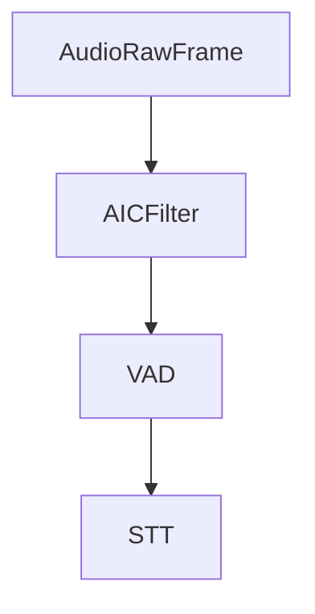

## Overview

`AICFilter` is an audio processor that improves users speech by reducing background noise and improving speech clarity overall. It inherits from `BaseAudioFilter` and processes audio frames to improve audio quality.

To use AIC, you need a license key. Get started at [ai-coustics.com](https://ai-coustics.com/pipecat).

## Installation

The AIC filter requires additional dependencies:

```bash
pip install "pipecat-ai[aic]"
```

## Constructor Parameters

<ParamField path="license_key" type="str" default="">
  AIC license key
</ParamField>

<ParamField path="model_type" type="int" default="0">
  Model
</ParamField>

<ParamField path="enhancement_level" type="float" default="1.0">
  Enhancement level
</ParamField>

<ParamField path="voice_gain" type="float" default="1.0">
  Voice gain
</ParamField>

<ParamField path="noise_gate_enable" type="bool" default="True">
  Enable noise gate
</ParamField>

## Input Frames

<ParamField path="FilterEnableFrame" type="Frame">
  Specific control frame to toggle filtering on/off

```python
from pipecat.frames.frames import FilterEnableFrame

# Disable noise reduction
await task.queue_frame(FilterEnableFrame(False))

# Re-enable noise reduction
await task.queue_frame(FilterEnableFrame(True))
```

</ParamField>

## Usage Example

```python
from pipecat.audio.filters.aic_filter import AICFilter

transport = DailyTransport(
    room_url,
    token,
    "Respond bot",
    DailyParams(
        audio_in_filter=AICFilter(), # Enable AIC speech improvement
        audio_in_enabled=True,
        audio_out_enabled=True,
        vad_analyzer=SileroVADAnalyzer(),
    ),
)
```

## Audio Flow



## Notes

- Requires ai-coustics license key
- Supports real-time audio processing
- Handles PCM_16 audio format
- Thread-safe for pipeline processing
- Can be dynamically enabled/disabled
- Maintains audio quality while improving speech, including noise reduction
- Efficient processing for low latency
