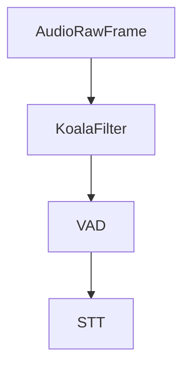

## Overview

`KoalaFilter` is an audio processor that reduces background noise in real-time audio streams using Koala Noise Suppression technology from Picovoice. It inherits from `BaseAudioFilter` and processes audio frames to improve audio quality by removing unwanted noise.

To use Koala, you need a Picovoice access key. Get started at [Picovoice Console](https://console.picovoice.ai/signup).

## Installation

The Koala filter requires additional dependencies:

```bash
pip install pipecat-ai[koala]
```

You'll also need to set up your Koala access key as an environment variable: `KOALA_ACCESS_KEY`

## Constructor Parameters

<ParamField path="access_key" type="str" required>
  Picovoice access key for using the Koala noise suppression service
</ParamField>

## Input Frames

<ParamField path="FilterEnableFrame" type="Frame">

Specific control frame to toggle filtering on/off

```python
# Disable noise reduction
await task.queue_frame(FilterEnableFrame(False))

# Re-enable noise reduction
await task.queue_frame(FilterEnableFrame(True))
```

</ParamField>

## Usage Example

```python
from pipecat.audio.filters.koala_filter import KoalaFilter

transport = DailyTransport(
    room_url,
    token,
    "Respond bot",
    DailyParams(
        audio_in_filter=KoalaFilter(access_key=os.getenv("KOALA_ACCESS_KEY")), # Enable Koala noise reduction
        audio_out_enabled=True,
        vad_enabled=True,
        vad_analyzer=SileroVADAnalyzer(),
    ),
)
```

## Audio Flow



## Notes

- Requires Picovoice access key
- Supports real-time audio processing
- Handles 16-bit PCM audio format
- Can be dynamically enabled/disabled
- Maintains audio quality while reducing noise
- Efficient processing for low latency
- Automatically handles audio frame buffering
- Sample rate must match Koala's required sample rate
