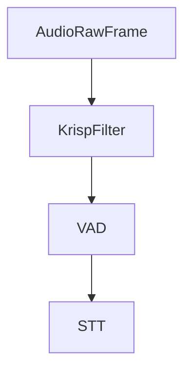

## Overview

`KrispFilter` is an audio processor that reduces background noise in real-time audio streams using Krisp AI technology. It inherits from `BaseAudioFilter` and processes audio frames to improve audio quality by removing unwanted noise.

To use Krisp, you need a Krisp SDK license. Get started at [Krisp.ai](https://krisp.ai/developers/).

<Tip>
  Looking for help getting started with Krisp and Pipecat? Checkout our [Krisp
  noise cancellation guide](/guides/krisp).
</Tip>

## Installation

The Krisp filter requires additional dependencies:

```bash
pip install pipecat-ai[krisp]
```

## Environment Variables

You need to provide the path to the Krisp model. This can either be done by setting the `KRISP_MODEL_PATH` environment variable or by setting the `model_path` in the constructor.

## Constructor Parameters

<ParamField path="sample_type" type="str" default="PCM_16">
  Audio sample type format
</ParamField>

<ParamField path="channels" type="int" default="1">
  Number of audio channels
</ParamField>

<ParamField path="model_path" type="str" default="None">
Path to the Krisp model file.

You can set the `model_path` directly. Alternatively, you can set the `KRISP_MODEL_PATH` environment variable to the model file path.

</ParamField>

## Input Frames

<ParamField path="AudioRawFrame" type="Frame" required>
  Raw audio data for noise reduction processing
</ParamField>

<ParamField path="FilterControlFrame" type="Frame">
  Control frames to enable/disable filtering
</ParamField>

<ParamField path="FilterEnableFrame" type="Frame">
  Specific control frame to toggle filtering on/off

```python
# Disable noise reduction
await task.queue_frame(FilterEnableFrame(False))

# Re-enable noise reduction
await task.queue_frame(FilterEnableFrame(True))
```

</ParamField>

## Output Frames

<ParamField path="AudioRawFrame" type="Frame">
  Processed audio data with reduced background noise
</ParamField>

## Usage Example

```python
transport = DailyTransport(
    room_url,
    token,
    "Respond bot",
    DailyParams(
        audio_in_filter=KrispFilter(), # Enable Krisp noise reduction
        audio_out_enabled=True,
        vad_enabled=True,
        vad_analyzer=SileroVADAnalyzer(),
        vad_audio_passthrough=True,
    ),
)
```

## Frame Flow



## Notes

- Requires Krisp SDK and model file to be available
- Supports real-time audio processing
- Supports additional features like background voice removal
- Handles PCM_16 audio format
- Thread-safe for pipeline processing
- Can be dynamically enabled/disabled
- Maintains audio quality while reducing noise
- Efficient processing for low latency
