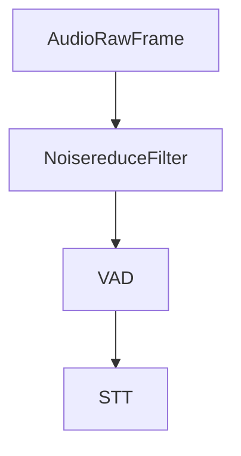

## Overview

`NoisereduceFilter` is an audio processor that reduces background noise in real-time audio streams using the noisereduce library. It inherits from `BaseAudioFilter` and processes audio frames to improve audio quality by removing unwanted noise.

## Installation

The noisereduce filter requires additional dependencies:

```bash
pip install "pipecat-ai[noisereduce]"
```

## Constructor Parameters

This filter has no configurable parameters in its constructor.

## Input Frames

<ParamField path="FilterEnableFrame" type="Frame">

Specific control frame to toggle filtering on/off

```python
from pipecat.frames.frames import FilterEnableFrame

# Disable noise reduction
await task.queue_frame(FilterEnableFrame(False))

# Re-enable noise reduction
await task.queue_frame(FilterEnableFrame(True))
```

</ParamField>

## Usage Example

```python
from pipecat.audio.filters.noisereduce_filter import NoisereduceFilter

transport = DailyTransport(
    room_url,
    token,
    "Respond bot",
    DailyParams(
        audio_in_filter=NoisereduceFilter(), # Enable noise reduction
        audio_in_enabled=True,
        audio_out_enabled=True,
        vad_analyzer=SileroVADAnalyzer(),
    ),
)
```

## Audio Flow



## Notes

- Lightweight alternative to Krisp for noise reduction
- Supports real-time audio processing
- Handles PCM_16 audio format
- Thread-safe for pipeline processing
- Can be dynamically enabled/disabled
- No additional configuration required
- Uses statistical noise reduction techniques
