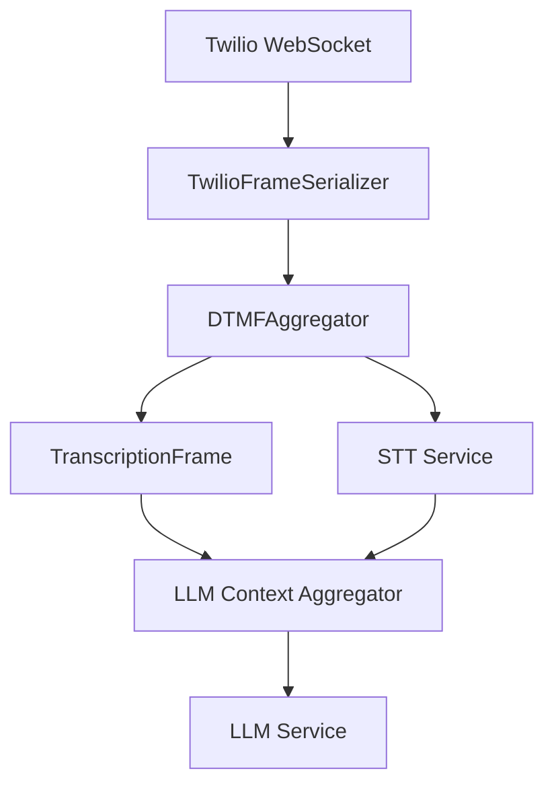

## Overview

`DTMFAggregator` processes incoming DTMF (Dual-Tone Multi-Frequency) frames from phone keypad input and aggregates them into complete sequences that can be understood by LLM services. It buffers individual digit presses and flushes them as transcription frames when a termination digit is pressed, a timeout occurs, or an interruption happens.

This aggregator is essential for telephony applications where users interact via phone keypad buttons, converting raw DTMF input into structured text that LLMs can process alongside voice transcriptions.

## Constructor

```python
aggregator = DTMFAggregator(
    timeout=2.0,
    termination_digit=KeypadEntry.POUND,
    prefix="DTMF: "
)
```

<ParamField path="timeout" type="float" default="2.0">
  Idle timeout in seconds before flushing the aggregated digits
</ParamField>

<ParamField
  path="termination_digit"
  type="KeypadEntry"
  default="KeypadEntry.POUND"
>
  Digit that triggers immediate flush of the aggregation
</ParamField>

<ParamField path="prefix" type="str" default="DTMF: ">
  Prefix added to DTMF sequence in the output transcription
</ParamField>

## Input Frames

<ParamField path="InputDTMFFrame" type="Frame">
  Contains a single keypad button press with a KeypadEntry value
</ParamField>

<ParamField path="StartInterruptionFrame" type="Frame">
  Flushes any pending aggregation when user interruption begins
</ParamField>

<ParamField path="EndFrame" type="Frame">
  Flushes pending aggregation and stops the aggregation task
</ParamField>

## Output Frames

<ParamField path="TranscriptionFrame" type="Frame">
  Contains the aggregated DTMF sequence as text with the configured prefix
</ParamField>

All input frames are passed through downstream, including the original `InputDTMFFrame` instances.

## Keypad Entries

The aggregator processes these standard phone keypad entries:

| KeypadEntry           | Value         | Description       |
| --------------------- | ------------- | ----------------- |
| `ZERO` through `NINE` | `"0"` - `"9"` | Numeric digits    |
| `STAR`                | `"*"`         | Star/asterisk key |
| `POUND`               | `"#"`         | Pound/hash key    |

## Aggregation Behavior

The aggregator flushes (emits a TranscriptionFrame) when:

1. **Termination digit**: The configured termination digit is pressed (default: `#`)
2. **Timeout**: No new digits received within the timeout period (default: 2 seconds)
3. **Interruption**: A `StartInterruptionFrame` is received
4. **Pipeline end**: An `EndFrame` is received

## Usage Examples

### Basic Telephony Integration

```python
from pipecat.processors.aggregators.dtmf_aggregator import DTMFAggregator
from pipecat.serializers.twilio import TwilioFrameSerializer

# Create DTMF aggregator with default settings
dtmf_aggregator = DTMFAggregator()

# Set up Twilio serializer for phone integration
serializer = TwilioFrameSerializer(
    stream_sid=stream_sid,
    call_sid=call_sid,
    account_sid=os.getenv("TWILIO_ACCOUNT_SID"),
    auth_token=os.getenv("TWILIO_AUTH_TOKEN")
)

# Create pipeline with DTMF processing
pipeline = Pipeline([
    transport.input(),      # Websocket input from Twilio
    dtmf_aggregator,       # Process DTMF before STT
    stt,                   # Speech-to-text service
    context_aggregator.user(),
    llm,                   # LLM processes both voice and DTMF
    tts,                   # Text-to-speech
    transport.output(),
    context_aggregator.assistant(),
])
```

### Custom Configuration for Menu Systems

```python
# Configure for menu system with star termination
menu_dtmf = DTMFAggregator(
    timeout=5.0,                    # Longer timeout for menu selection
    termination_digit=KeypadEntry.STAR,  # Use * to confirm selection
    prefix="Menu selection: "       # Clear prefix for LLM
)

# Update system prompt to handle DTMF input
messages = [
    {
        "role": "system",
        "content": """You are a phone menu assistant.

When you receive input starting with "Menu selection:", this represents
button presses on the phone keypad:
- Single digits (1-9): Menu options
- 0: Often "speak to operator"
- *: Confirmation or "go back"
- #: Usually "repeat menu"

Respond appropriately to both voice and keypad input."""
    }
]
```

## Sequence Examples

| User Input         | Aggregation Trigger    | Output TranscriptionFrame |
| ------------------ | ---------------------- | ------------------------- |
| `1`, `2`, `3`, `#` | Termination digit      | `"DTMF: 123#"`            |
| `*`, `0`           | 2-second timeout       | `"DTMF: *0"`              |
| `5`, interruption  | StartInterruptionFrame | `"DTMF: 5"`               |
| `9`, `9`, EndFrame | Pipeline shutdown      | `"DTMF: 99"`              |

## Frame Flow



## Error Handling

The aggregator gracefully handles:

- Invalid DTMF digits (logged and ignored)
- Pipeline interruptions (flushes pending sequences)
- Rapid key presses (buffers efficiently)
- Mixed voice and DTMF input (processes independently)

## Best Practices

1. **System Prompt Design**: Train your LLM to recognize and respond to DTMF prefixed input
2. **Timeout Configuration**: Use shorter timeouts (1-2s) for rapid entry, longer (3-5s) for menu selection
3. **Termination Strategy**: Use `#` for confirmation, `*` for cancel/back operations
4. **Pipeline Placement**: Always place before the user context aggregator to ensure proper frame ordering
