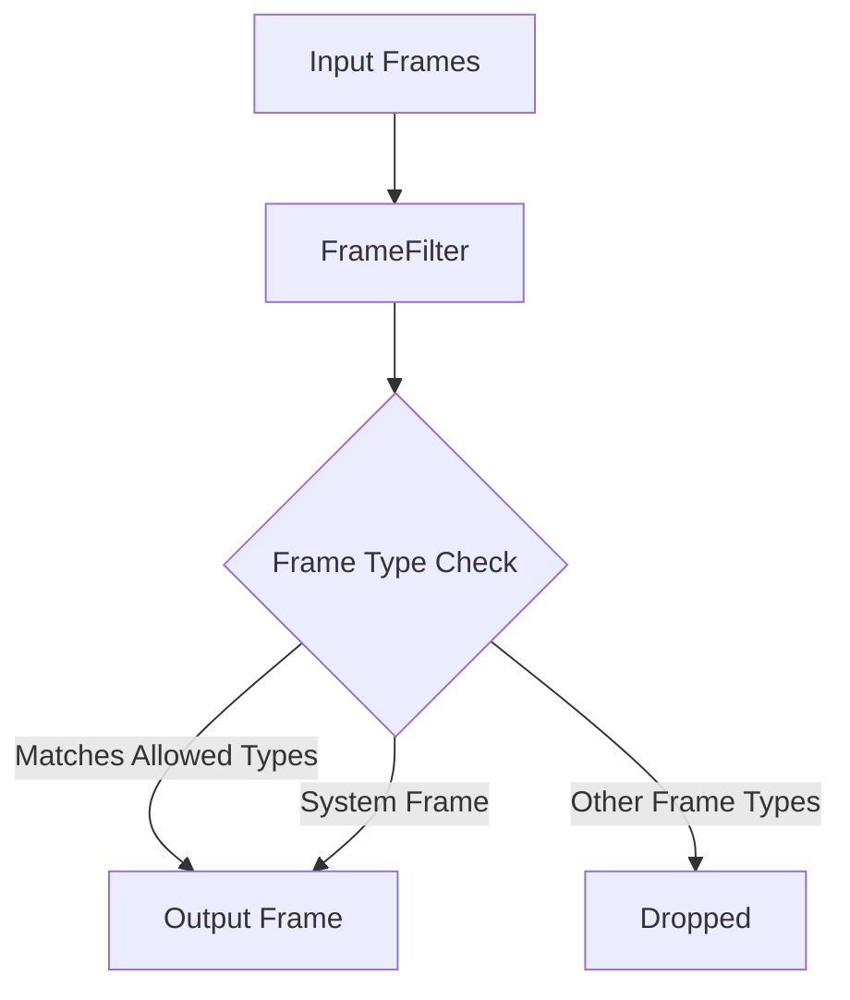

## Overview

`FrameFilter` is a processor that filters frames based on their types, only passing through frames that match specified types (plus some system frames like `EndFrame` and `SystemFrame`).

## Constructor Parameters

<ParamField path="types" type="Tuple[Type[Frame], ...]" required>
  Tuple of frame types that should be passed through the filter
</ParamField>

## Functionality

When a frame passes through the filter, it is checked against the provided types. Only frames that match one of the specified types (or are system frames) will be passed downstream. All other frames are dropped.

## Output Frames

The processor always passes through:

- Frames matching any of the specified types
- `EndFrame` and `SystemFrame` instances (always allowed, so as to not block the pipeline)

## Usage Example

```python
from pipecat.frames.frames import TextFrame, AudioRawFrame, Frame
from pipecat.processors.filters import FrameFilter
from typing import Tuple, Type

# Create a filter that only passes TextFrames and AudioRawFrames
text_and_audio_filter = FrameFilter(
    types=(TextFrame, AudioRawFrame)
)

# Add to pipeline
pipeline = Pipeline([
    source,
    text_and_audio_filter,  # Filters out all other frame types
    destination
])
```

## Frame Flow



## Notes

- Simple but powerful way to restrict which frame types flow through parts of your pipeline
- Always allows system frames to pass through for proper pipeline operation
- Can be used to isolate specific parts of your pipeline from certain frame types
- Efficient implementation with minimal overhead
