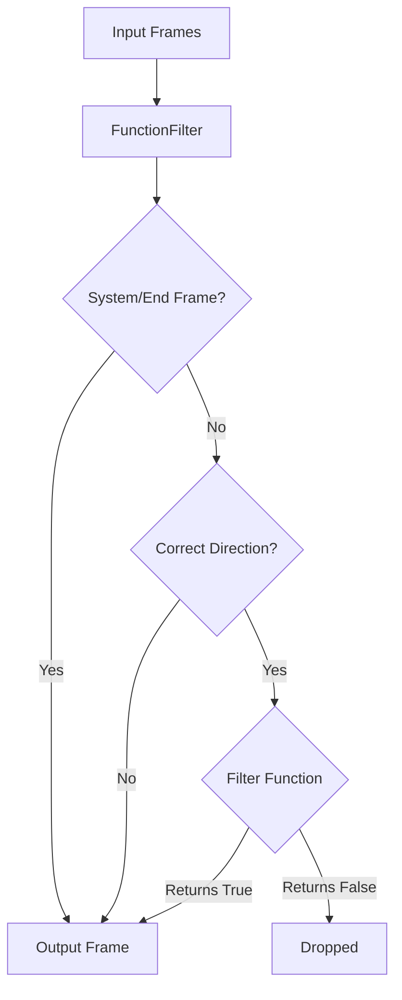

## Overview

`FunctionFilter` is a flexible processor that uses a custom async function to determine which frames to pass through. This allows for complex, dynamic filtering logic beyond simple type checking.

## Constructor Parameters

<ParamField path="filter" type="Callable[[Frame], Awaitable[bool]]" required>
  Async function that examines each frame and returns True to allow it or False
  to filter it out
</ParamField>

<ParamField
  path="direction"
  type="FrameDirection"
  default="FrameDirection.DOWNSTREAM"
>
  Which direction of frames to filter (DOWNSTREAM or UPSTREAM)
</ParamField>

## Functionality

When a frame passes through the processor:

1. System frames and end frames are always passed through
2. Frames moving in a different direction than specified are always passed through
3. Other frames are passed to the filter function
4. If the filter function returns True, the frame is passed through

## Output Frames

The processor conditionally passes through frames based on:

- Frame type (system frames and end frames always pass)
- Frame direction (only filters in the specified direction)
- Result of the custom filter function

## Usage Example

```python
from pipecat.frames.frames import TextFrame, Frame
from pipecat.processors.filters import FunctionFilter
from pipecat.processors.frame_processor import FrameDirection

# Create filter that only allows TextFrames with more than 10 characters
async def long_text_filter(frame: Frame) -> bool:
    if isinstance(frame, TextFrame):
        return len(frame.text) > 10
    return False

# Apply filter to downstream frames only
text_length_filter = FunctionFilter(
    filter=long_text_filter,
    direction=FrameDirection.DOWNSTREAM
)

# Add to pipeline
pipeline = Pipeline([
    source,
    text_length_filter,  # Filters out short text frames
    destination
])
```

## Frame Flow



## Notes

- Provides maximum flexibility for complex filtering logic
- Can incorporate dynamic conditions that change at runtime
- Only filters frames moving in the specified direction
- Always passes through system frames for proper pipeline operation
- Can be used to create sophisticated content-based filters
- Supports async filter functions for complex processing
