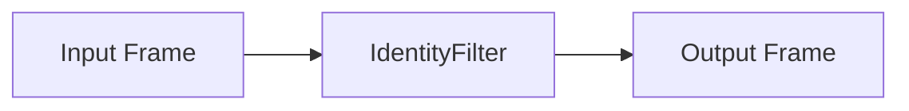

## Overview

`IdentityFilter` is a simple pass-through processor that forwards all frames without any modification or filtering. It acts as a transparent layer in your pipeline, allowing all frames to flow through unchanged.

<Tip>
  Check out Observers for an option that delivers similar functionality but
  doesn't require a processor to reside in the Pipeline.
</Tip>

## Constructor Parameters

The `IdentityFilter` constructor accepts no specific parameters beyond those inherited from `FrameProcessor`.

## Functionality

When a frame passes through the processor, it is immediately forwarded in the same direction with no changes. This applies to all frame types and both directions (upstream and downstream).

## Use Cases

While functionally equivalent to having no filter at all, `IdentityFilter` can be useful in several scenarios:

- Testing `ParallelPipeline` configurations to ensure frames aren't duplicated
- Acting as a placeholder where a more complex filter might be added later
- Monitoring frame flow in pipelines by adding logging in subclasses
- Creating a base class for more complex conditional filters

## Usage Example

```python
from pipecat.processors.filters import IdentityFilter

# Create an identity filter
pass_through = IdentityFilter()

# Add to pipeline
pipeline = Pipeline([
    source,
    pass_through,  # All frames pass through unchanged
    destination
])
```

## Frame Flow



## Notes

- Simplest possible filter implementation
- Passes all frames through without modification
- Useful in testing parallel pipelines
- Can serve as a placeholder or base class
- Zero overhead in normal operation
