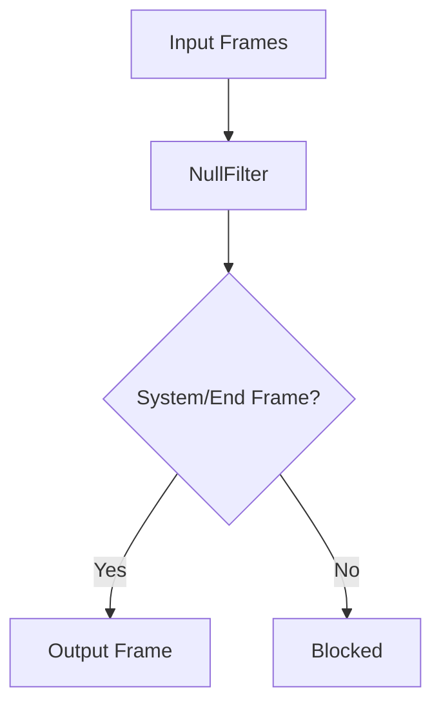

## Overview

`NullFilter` is a filtering processor that blocks all frames from passing through, with the exception of system frames and end frames which are required for proper pipeline operation.

## Constructor Parameters

The `NullFilter` constructor accepts no specific parameters beyond those inherited from `FrameProcessor`.

## Functionality

When a frame passes through the processor:

- If the frame is a `SystemFrame` or `EndFrame`, it is passed through
- All other frame types are blocked and do not continue through the pipeline

This filter effectively acts as a barrier that allows only the essential system frames required for pipeline initialization, shutdown, and management.

## Use Cases

`NullFilter` is useful in several scenarios:

- Temporarily disabling parts of a pipeline without removing components
- Creating dead-end branches in parallel pipelines
- Testing pipeline behavior with blocked communication
- Implementing conditional pipelines where certain paths should be blocked

## Usage Example

```python
from pipecat.processors.filters import NullFilter

# Create a null filter that blocks all non-system frames
blocker = NullFilter()

# Add to pipeline
pipeline = Pipeline([
    source,
    blocker,  # Blocks all regular frames
    destination  # Will only receive system frames
])
```

## Frame Flow



## Notes

- Blocks all regular frames in both directions
- Only allows system frames and end frames to pass through
- Useful for testing, debugging, and creating conditional pipelines
- Minimal overhead as it performs simple type checking
- Can be used to temporarily disable parts of a pipeline
