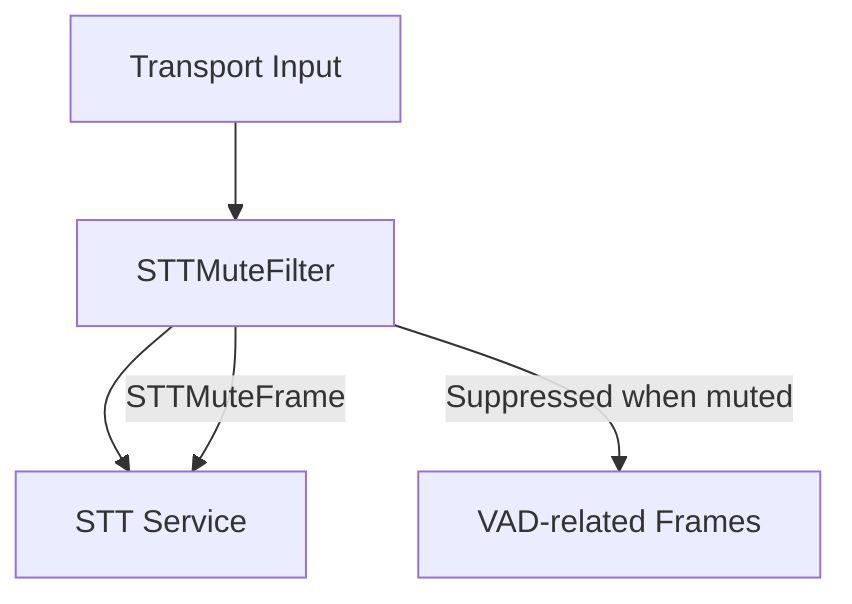

<Warning>
DEPRECATED: STTMuteFilter has been deprecated in favor of [User Mute Strategies](/server/utilities/user-mute-strategies). Configure `user_mute_strategies` on the `LLMUserAggregator` instead.
</Warning>

## Overview

`STTMuteFilter` is a general-purpose processor that combines STT muting and interruption control. When active, it prevents both transcription and interruptions during specified conditions (e.g., bot speech, function calls), providing a cleaner conversation flow.

The processor supports multiple simultaneous strategies for when to mute the STT service, making it flexible for different use cases.

<Tip>
  Want to try it out? Check out the [STTMuteFilter foundational
  demo](https://github.com/pipecat-ai/pipecat/blob/main/examples/foundational/24-stt-mute-filter.py)
</Tip>

## Constructor Parameters

<ParamField path="config" type="STTMuteConfig" required>
  Configuration object that defines the muting strategies and optional custom
  logic
</ParamField>

<ParamField path="stt_service" type="Optional[STTService]" required>
  The STT service to control (deprecated, will be removed in a future version)
</ParamField>

## Configuration

The processor is configured using `STTMuteConfig`, which determines when and how the STT service should be muted:

<ParamField path="strategies" type="set[STTMuteStrategy]">
  Set of muting strategies to apply
</ParamField>

<ParamField
  path="should_mute_callback"
  type="Callable[[STTMuteFilter], Awaitable[bool]]"
  default="None"
>
  Optional callback for custom muting logic (required when strategy is `CUSTOM`)
</ParamField>

### Muting Strategies

`STTMuteConfig` accepts a set of these `STTMuteStrategy` values:

<ParamField path="FIRST_SPEECH" type="STTMuteStrategy">
  Mute only during the bot's first speech (typically during introduction)
</ParamField>

<ParamField path="MUTE_UNTIL_FIRST_BOT_COMPLETE" type="STTMuteStrategy">
  Start muted and remain muted until first bot speech completes. Useful when bot
  speaks first and you want to ensure its first response cannot be interrupted.
</ParamField>

<ParamField path="FUNCTION_CALL" type="STTMuteStrategy">
  Mute during LLM function calls (e.g., API requests, external service calls)
</ParamField>

<ParamField path="ALWAYS" type="STTMuteStrategy">
  Mute during all bot speech
</ParamField>

<ParamField path="CUSTOM" type="STTMuteStrategy">
  Use custom logic provided via callback to determine when to mute. The callback
  is invoked when the bot is speaking and can use application state to decide
  whether to mute. When the bot stops speaking, unmuting occurs automatically if
  no other strategy requires muting.
</ParamField>

<Note>
  `MUTE_UNTIL_FIRST_BOT_COMPLETE` and `FIRST_SPEECH` strategies should not be
  used together as they handle the first bot speech differently.
</Note>

## Input Frames

<ParamField path="BotStartedSpeakingFrame" type="Frame">
  Indicates bot has started speaking
</ParamField>

<ParamField path="BotStoppedSpeakingFrame" type="Frame">
  Indicates bot has stopped speaking
</ParamField>

<ParamField path="FunctionCallInProgressFrame" type="Frame">
  Indicates a function call has started
</ParamField>

<ParamField path="FunctionCallResultFrame" type="Frame">
  Indicates a function call has completed
</ParamField>

<ParamField path="InterimTranscriptionFrame" type="Frame">
  Indicates an interim transcription result (suppressed when muted)
</ParamField>

<ParamField path="StartInterruptionFrame" type="Frame">
  User interruption start event (suppressed when muted)
</ParamField>

<ParamField path="StopInterruptionFrame" type="Frame">
  User interruption stop event (suppressed when muted)
</ParamField>

<ParamField path="TranscriptionFrame" type="Frame">
  Indicates a transcription result (suppressed when muted)
</ParamField>

<ParamField path="UserStartedSpeakingFrame" type="Frame">
  Indicates user has started speaking (suppressed when muted)
</ParamField>

<ParamField path="UserStoppedSpeakingFrame" type="Frame">
  Indicates user has stopped speaking (suppressed when muted)
</ParamField>

## Output Frames

<ParamField path="STTMuteFrame" type="Frame">
  Control frame to mute/unmute the STT service
</ParamField>

All input frames are passed through except VAD-related frames (interruptions and user speaking events) when muted.

## Usage Examples

### Basic Usage (Mute During Bot's First Speech)

```python
stt = DeepgramSTTService(api_key=os.getenv("DEEPGRAM_API_KEY"))
stt_mute_filter = STTMuteFilter(
    config=STTMuteConfig(strategies={
        STTMuteStrategy.FIRST_SPEECH
    })
)

pipeline = Pipeline([
    transport.input(),
    stt,
    stt_mute_filter,  # Between the STT service and context aggregator
    context_aggregator.user(),
    # ... rest of pipeline
])
```

### Mute Until First Bot Response Completes

```python
stt_mute_filter = STTMuteFilter(
    config=STTMuteConfig(strategies={STTMuteStrategy.MUTE_UNTIL_FIRST_BOT_COMPLETE})
)
```

This ensures no user speech is processed until after the bot's first complete response.

### Always Mute During Bot Speech

```python
stt_mute_filter = STTMuteFilter(
    config=STTMuteConfig(strategies={STTMuteStrategy.ALWAYS})
)
```

### Custom Muting Logic

The `CUSTOM` strategy allows you to control muting based on application state when the bot is speaking. The callback will be invoked whenever the bot is speaking, and your logic decides whether to mute:

```python
# Create a state manager
class SessionState:
    def __init__(self):
        self.session_ending = False

session_state = SessionState()

# Callback function that determines whether to mute
async def session_state_mute_logic(stt_filter: STTMuteFilter) -> bool:
    # Return True to mute, False otherwise
    # This is called when the bot is speaking
    return session_state.session_ending

# Configure filter with CUSTOM strategy
stt_mute_filter = STTMuteFilter(
    config=STTMuteConfig(
        strategies={STTMuteStrategy.CUSTOM},
        should_mute_callback=session_state_mute_logic
    )
)

# Later, when you want to trigger muting (e.g., during session timeout):
async def handle_session_timeout():
    # Update state that will be checked by the callback
    session_state.session_ending = True

    # Send goodbye message
    goodbye_message = "Thank you for using our service. This session is now ending."
    await pipeline.push_frame(TTSSpeakFrame(text=goodbye_message))

    # The system will automatically mute during this message because:
    # 1. Bot starts speaking, triggering the callback
    # 2. Callback returns True (session_ending is True)
    # 3. When bot stops speaking, unmuting happens automatically
```

### Combining Multiple Strategies

```python
async def custom_mute_logic(processor: STTMuteFilter) -> bool:
    # Example: Mute during business hours only
    current_hour = datetime.now().hour
    return 9 <= current_hour < 17

stt_mute_filter = STTMuteFilter(
    config=STTMuteConfig(
        strategies={
            STTMuteStrategy.FUNCTION_CALL,       # Mute during function calls
            STTMuteStrategy.CUSTOM,              # And during business hours
            STTMuteStrategy.MUTE_UNTIL_FIRST_BOT_COMPLETE  # And until first bot speech completes
        },
        should_mute_callback=custom_mute_logic
    )
)
```

### Frame Flow



## Notes

- Combines STT muting and interruption control into a single concept
- Muting prevents both transcription and interruptions
- Multiple strategies can be active simultaneously
- CUSTOM strategy callback is only invoked when the bot is speaking
- Unmuting happens automatically when bot speech ends (if no other strategy requires muting)
- Placed between the STT service and context aggregator in pipeline
- Maintains conversation flow during bot speech and function calls
- Efficient state tracking for minimal overhead
