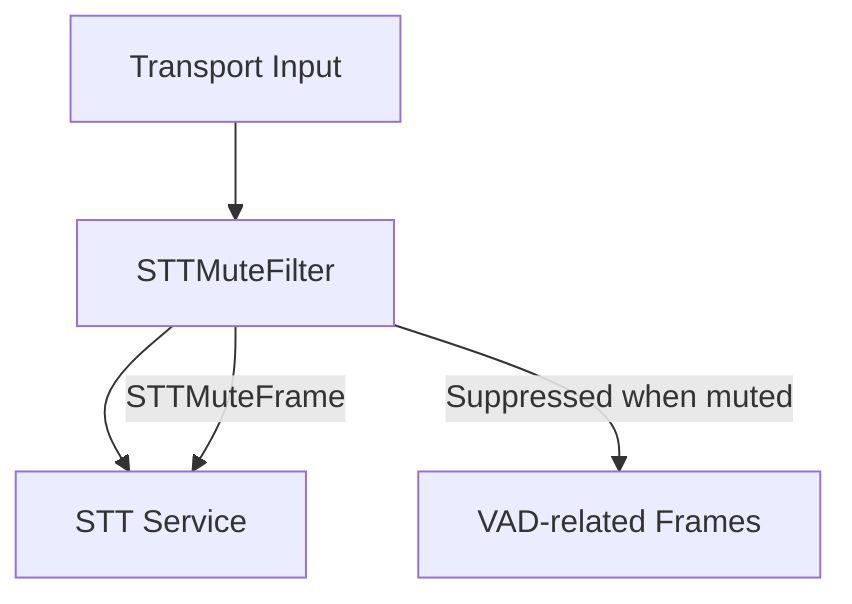

## Overview

`STTMuteFilter` is a general-purpose processor that combines STT muting and interruption control. When active, it prevents both transcription and interruptions during specified conditions (e.g., bot speech, function calls), providing a cleaner conversation flow.

The processor supports multiple simultaneous strategies for when to mute the STT service, making it flexible for different use cases.

<Tip>
  Want to try it out? Check out the [STTMuteFilter foundational
  demo](https://github.com/pipecat-ai/pipecat/blob/main/examples/foundational/24-stt-mute-filter.py)
</Tip>

## Constructor Parameters

<ParamField path="config" type="STTMuteConfig" required>
  Configuration object that defines the muting strategies and optional custom
  logic
</ParamField>

<ParamField path="stt_service" type="Optional[STTService]" required>
  The STT service to control (deprecated, will be removed in a future version)
</ParamField>

## Configuration

The processor is configured using `STTMuteConfig`, which determines when and how the STT service should be muted:

<ParamField path="strategies" type="set[STTMuteStrategy]">
  Set of muting strategies to apply
</ParamField>

<ParamField
  path="should_mute_callback"
  type="Callable[[STTMuteFilter], Awaitable[bool]]"
  default="None"
>
  Optional callback for custom muting logic (required when strategy is `CUSTOM`)
</ParamField>

### Muting Strategies

`STTMuteConfig` accepts a set of these `STTMuteStrategy` values:

<ParamField path="FIRST_SPEECH" type="STTMuteStrategy">
  Mute only during the bot's first speech (typically during introduction)
</ParamField>

<ParamField path="FUNCTION_CALL" type="STTMuteStrategy">
  Mute during LLM function calls (e.g., API requests, external service calls)
</ParamField>

<ParamField path="ALWAYS" type="STTMuteStrategy">
  Mute during all bot speech
</ParamField>

<ParamField path="CUSTOM" type="STTMuteStrategy">
  Use custom logic provided via callback to determine when to mute
</ParamField>

## Input Frames

<ParamField path="BotStartedSpeakingFrame" type="Frame">
  Indicates bot has started speaking
</ParamField>

<ParamField path="BotStoppedSpeakingFrame" type="Frame">
  Indicates bot has stopped speaking
</ParamField>

<ParamField path="FunctionCallInProgressFrame" type="Frame">
  Indicates a function call has started
</ParamField>

<ParamField path="FunctionCallResultFrame" type="Frame">
  Indicates a function call has completed
</ParamField>

<ParamField path="StartInterruptionFrame" type="Frame">
  User interruption start event (suppressed when muted)
</ParamField>

<ParamField path="StopInterruptionFrame" type="Frame">
  User interruption stop event (suppressed when muted)
</ParamField>

<ParamField path="UserStartedSpeakingFrame" type="Frame">
  Indicates user has started speaking (suppressed when muted)
</ParamField>

<ParamField path="UserStoppedSpeakingFrame" type="Frame">
  Indicates user has stopped speaking (suppressed when muted)
</ParamField>

## Output Frames

<ParamField path="STTMuteFrame" type="Frame">
  Control frame to mute/unmute the STT service
</ParamField>

All input frames are passed through except VAD-related frames (interruptions and user speaking events) when muted.

## Usage Examples

### Basic Usage (Mute During First Speech)

```python
stt = DeepgramSTTService(api_key=os.getenv("DEEPGRAM_API_KEY"))
stt_mute_filter = STTMuteFilter(
    config=STTMuteConfig(strategies={
        STTMuteStrategy.FIRST_SPEECH
    })
)

pipeline = Pipeline([
    transport.input(),
    stt_mute_filter,  # Add before STT service
    stt,
    # ... rest of pipeline
])
```

### Always Mute During Bot Speech

```python
stt_mute_filter = STTMuteFilter(
    config=STTMuteConfig(strategies={STTMuteStrategy.ALWAYS})
)
```

### Custom Muting Logic with Function Calls

```python
async def custom_mute_logic(processor: STTMuteFilter) -> bool:
    # Example: Mute during business hours only
    current_hour = datetime.now().hour
    return processor._bot_is_speaking and (9 <= current_hour < 17)

stt_mute_filter = STTMuteFilter(
    config=STTMuteConfig(
        strategies={
            STTMuteStrategy.CUSTOM,
            STTMuteStrategy.FUNCTION_CALL
        },
        should_mute_callback=custom_mute_logic
    )
)
```

### Frame Flow



## Notes

- Combines STT muting and interruption control into a single concept
- Muting prevents both transcription and interruptions
- Multiple strategies can be active simultaneously
- Custom strategy allows for complex muting logic
- Placed before STT service in pipeline
- Maintains conversation flow during bot speech and function calls
- Efficient state tracking for minimal overhead
