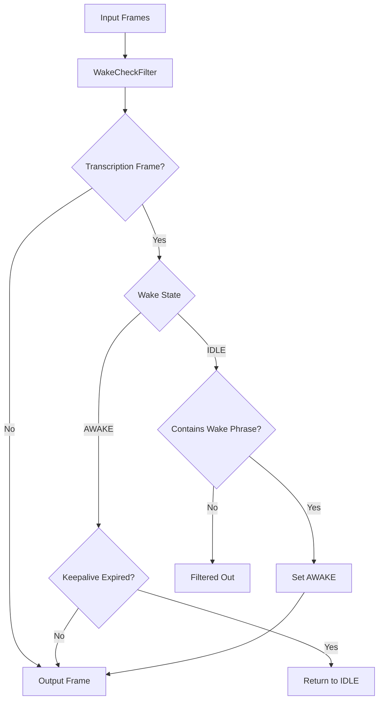

## Overview

`WakeCheckFilter` monitors `TranscriptionFrame`s for specified wake phrases and only allows frames to pass through after a wake phrase has been detected. It includes a keepalive timeout to maintain the awake state for a period after detection, allowing continuous conversation without requiring repeated wake phrases.

## Constructor Parameters

<ParamField path="wake_phrases" type="list[str]" required>
  List of wake phrases to detect in transcriptions
</ParamField>

<ParamField path="keepalive_timeout" type="float" default="3">
  Number of seconds to remain in the awake state after each transcription
</ParamField>

## Functionality

The filter maintains state for each participant and processes frames as follows:

1. `TranscriptionFrame` objects are checked for wake phrases
2. If a wake phrase is detected, the filter enters the "AWAKE" state
3. While in the "AWAKE" state, all transcription frames pass through
4. After no activity for the keepalive timeout period, the filter returns to "IDLE"
5. All non-transcription frames pass through normally

Wake phrases are detected using regular expressions that match whole words with flexible spacing, making detection resilient to minor transcription variations.

## States

<ParamField path="IDLE" type="WakeState">
  Default state - only non-transcription frames pass through
</ParamField>

<ParamField path="AWAKE" type="WakeState">
  Active state after wake phrase detection - all frames pass through
</ParamField>

## Output Frames

- All non-transcription frames pass through unchanged
- After wake phrase detection, transcription frames pass through
- When awake, transcription frames reset the keepalive timer

## Usage Example

```python
from pipecat.processors.filters import WakeCheckFilter

# Create filter with wake phrases
wake_filter = WakeCheckFilter(
    wake_phrases=["hey assistant", "ok computer", "listen up"],
    keepalive_timeout=5.0  # Stay awake for 5 seconds after each transcription
)

# Add to pipeline
pipeline = Pipeline([
    transport.input(),
    stt_service,
    wake_filter,  # Only passes transcriptions after wake phrases
    llm_service,
    tts_service,
    transport.output()
])
```

## Frame Flow



## Notes

- Maintains separate state for each participant ID
- Uses regex pattern matching for resilient wake phrase detection
- Accumulates transcription text to detect phrases across multiple frames
- Trims accumulated text when wake phrase is detected
- Supports multiple wake phrases
- Passes all non-transcription frames through unchanged
- Error handling produces ErrorFrames for robust operation
- Case-insensitive matching for natural language use
