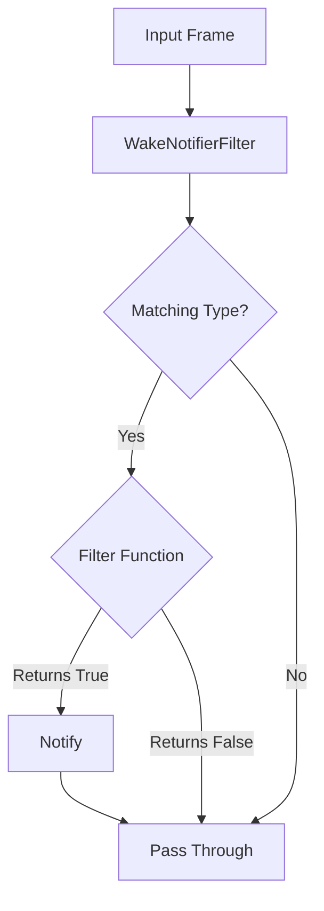

## Overview

`WakeNotifierFilter` monitors the pipeline for specific frame types and triggers a notification when those frames pass a custom filter condition. It passes all frames through unchanged while performing this notification side-effect.

## Constructor Parameters

<ParamField path="notifier" type="BaseNotifier" required>
  The notifier object to trigger when conditions are met
</ParamField>

<ParamField path="types" type="Tuple[Type[Frame]]" required>
  Tuple of frame types to monitor
</ParamField>

<ParamField path="filter" type="Callable[[Frame], Awaitable[bool]]" required>
  Async function that examines each matching frame and returns True to trigger
  notification
</ParamField>

## Functionality

The processor operates as follows:

1. Checks if the incoming frame matches any of the specified types
2. If it's a matching type, calls the filter function with the frame
3. If the filter returns True, triggers the notifier
4. Passes all frames through unchanged, regardless of the filtering result

This allows for notification side-effects without modifying the pipeline's data flow.

## Output Frames

- All frames pass through unchanged in their original direction
- No frames are modified or filtered out

## Usage Example

```python
from pipecat.frames.frames import TranscriptionFrame, UserStartedSpeakingFrame
from pipecat.processors.filters import WakeNotifierFilter
from pipecat.sync.event_notifier import EventNotifier

# Create an event notifier
wake_event = EventNotifier()

# Create filter that notifies when certain wake phrases are detected
async def wake_phrase_filter(frame):
    if isinstance(frame, TranscriptionFrame):
        return "hey assistant" in frame.text.lower()
    return False

# Add to pipeline
wake_notifier = WakeNotifierFilter(
    notifier=wake_event,
    types=(TranscriptionFrame, UserStartedSpeakingFrame),
    filter=wake_phrase_filter
)

# In another component, wait for the notification
async def handle_wake_event():
    await wake_event.wait()
    print("Wake phrase detected!")
```

## Frame Flow



## Notes

- Acts as a transparent pass-through for all frames
- Can trigger external events without modifying pipeline flow
- Useful for signaling between pipeline components
- Can monitor for multiple frame types simultaneously
- Uses async filter function for complex conditions
- Functions as a "listener" that doesn't affect the data stream
- Can be used for logging, analytics, or coordinating external systems
