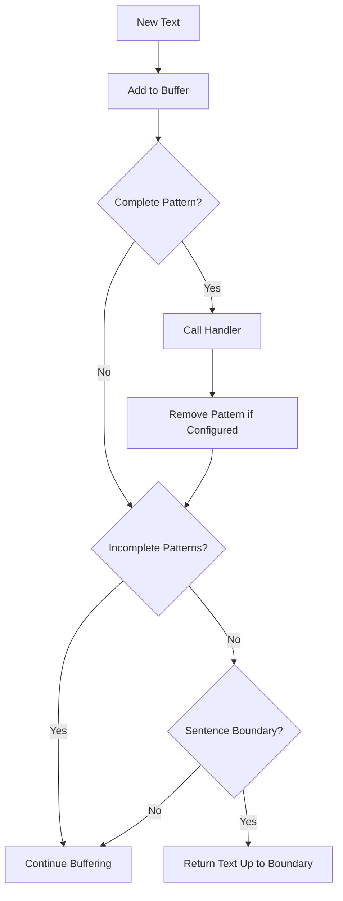

## Overview

`PatternPairAggregator` is a specialized text aggregator that buffers streaming text until it can identify complete pattern pairs (like XML tags, markdown formatting, or custom delimiters). It processes the content between these patterns using registered handlers and returns text at sentence boundaries (therefore allowing normal TTS processing to occur).

This aggregator is particularly useful for applications like voice switching, structured content processing, and extracting metadata from LLM outputs, ensuring that patterns spanning multiple text chunks are correctly identified.

<Tip>
  Want to see it in action? Check out the [voice switching
  demo](https://github.com/pipecat-ai/pipecat/blob/main/examples/foundational/35-pattern-pair-voice-switching.py).
</Tip>

## Constructor

```python
aggregator = PatternPairAggregator()
```

No parameters are required for initialization. The aggregator starts with an empty buffer and no registered patterns.

## Methods

### add_pattern_pair

```python
aggregator.add_pattern_pair(pattern_id, start_pattern, end_pattern, remove_match=True)
```

Registers a new pattern pair to detect in the text.

<ParamField path="pattern_id" type="str" required>
  Unique identifier for this pattern pair
</ParamField>

<ParamField path="start_pattern" type="str" required>
  Pattern that marks the beginning of content
</ParamField>

<ParamField path="end_pattern" type="str" required>
  Pattern that marks the end of content
</ParamField>

<ParamField path="remove_match" type="bool" default="True">
  Whether to remove the matched patterns from the output text
</ParamField>

<ResponseField name="Returns">Self for method chaining</ResponseField>

### on_pattern_match

```python
aggregator.on_pattern_match(pattern_id, handler)
```

Registers a handler function to be called when a specific pattern pair is matched.

<ParamField path="pattern_id" type="str" required>
  ID of the pattern pair to match
</ParamField>

<ParamField path="handler" type="Callable[[PatternMatch], None]" required>
  Function to call when the pattern is matched. The function should accept a
  PatternMatch object.
</ParamField>

<ResponseField name="Returns">Self for method chaining</ResponseField>

## Pattern Match Object

When a pattern is matched, the handler function receives a `PatternMatch` object with these attributes:

<ResponseField name="pattern_id" type="str">
  The identifier of the matched pattern pair
</ResponseField>

<ResponseField name="full_match" type="str">
  The complete text including start and end patterns
</ResponseField>

<ResponseField name="content" type="str">
  The text content between the start and end patterns
</ResponseField>

## Usage Examples

### Voice Switching in TTS

```python
# Define voice IDs
VOICE_IDS = {
    "narrator": "c45bc5ec-dc68-4feb-8829-6e6b2748095d",
    "female": "71a7ad14-091c-4e8e-a314-022ece01c121",
    "male": "7cf0e2b1-8daf-4fe4-89ad-f6039398f359",
}

# Create pattern aggregator
pattern_aggregator = PatternPairAggregator()

# Add pattern for voice tags
pattern_aggregator.add_pattern_pair(
    pattern_id="voice_tag",
    start_pattern="<voice>",
    end_pattern="</voice>",
    remove_match=True
)

# Register handler for voice switching
def on_voice_tag(match: PatternMatch):
    voice_name = match.content.strip().lower()
    if voice_name in VOICE_IDS:
        voice_id = VOICE_IDS[voice_name]
        tts.set_voice(voice_id)
        logger.info(f"Switched to {voice_name} voice")

pattern_aggregator.on_pattern_match("voice_tag", on_voice_tag)

# Set the aggregator on a TTS service
tts = CartesiaTTSService(
    api_key=os.getenv("CARTESIA_API_KEY"),
    voice_id=VOICE_IDS["narrator"],
    text_aggregator=pattern_aggregator
)
```

### Extracting Structured Data from LLM Outputs

````python
# Create pattern aggregator
data_extractor = PatternPairAggregator()

# Add pattern for JSON data
data_extractor.add_pattern_pair(
    pattern_id="json_data",
    start_pattern="```json",
    end_pattern="```",
    remove_match=True
)

# Track extracted data
extracted_data = {}

# Register handler for JSON data
def on_json_data(match: PatternMatch):
    try:
        data = json.loads(match.content)
        extracted_data.update(data)
    except json.JSONDecodeError as e:
        logger.error(f"Failed to parse JSON: {e}")

data_extractor.on_pattern_match("json_data", on_json_data)
````

### Concept Explanation with Multiple Patterns

```python
# Create pattern aggregator
concept_aggregator = PatternPairAggregator()

# Add patterns for different parts of an explanation
concept_aggregator.add_pattern_pair(
    pattern_id="definition",
    start_pattern="<definition>",
    end_pattern="</definition>",
    remove_match=False  # Keep the tags in the output
)

concept_aggregator.add_pattern_pair(
    pattern_id="example",
    start_pattern="<example>",
    end_pattern="</example>",
    remove_match=False
)

# Register handlers
def on_definition(match: PatternMatch):
    logger.info(f"Found definition: {match.content}")
    # Could format differently, store for later, etc.

def on_example(match: PatternMatch):
    logger.info(f"Found example: {match.content}")
    # Could create a visual representation, etc.

concept_aggregator.on_pattern_match("definition", on_definition)
concept_aggregator.on_pattern_match("example", on_example)
```

## How It Works



## Notes

- Patterns are processed in the order they appear in the text
- Handlers are called when complete patterns are found
- Patterns can span multiple sentences of text, but be aware that encoding many "reasoning" tokens may slow down the LLM response
