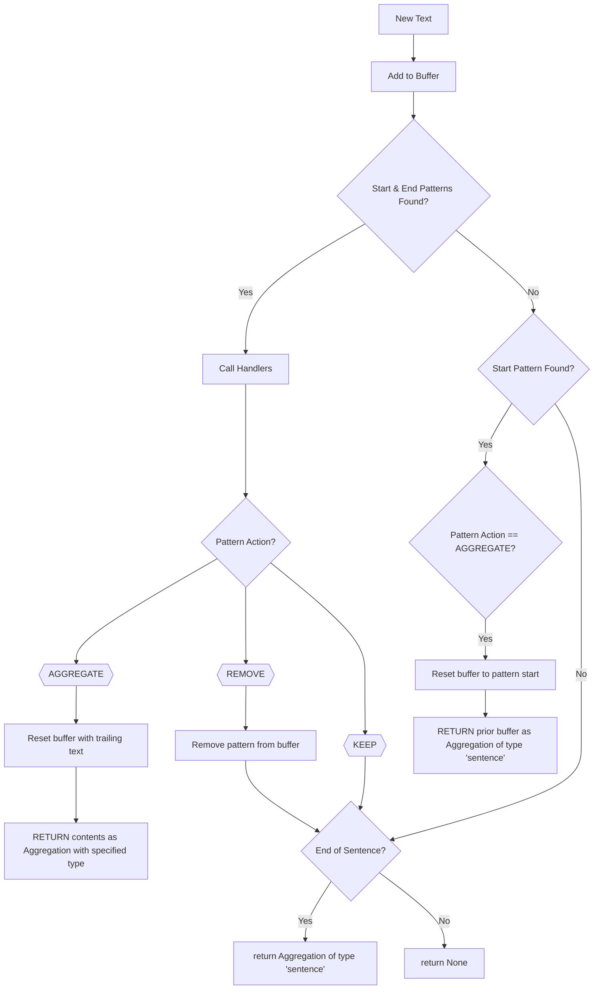

## Overview

`PatternPairAggregator` is a specialized text aggregator that buffers streaming text until it can identify complete pattern pairs (like XML tags, markdown formatting, or custom delimiters). It processes the content between these patterns using a set of pre-defined actions (remove, keep, or aggregate) and returns text outside those patterns at sentence boundaries. The aggregator supports registering callback functions that are invoked when specific pattern pairs are matched, allowing for custom processing when matches occur. Note: These callbacks do not support modifying the text being aggregated; they are intended for side effects like logging or updating state.

This aggregator is particularly useful for applications like voice switching, structured content processing, and extracting metadata from LLM outputs, ensuring that patterns spanning multiple text chunks are correctly identified or categorizing text based on embedded markers for downstream services and processing to treat different segments appropriately. For example: identifying URL patterns, code blocks, or special formatting in LLM responses that may need special speech handling in the TTS or client-side handling via RTVI.

<Tip>
  Want to see it in action? Check out the [voice switching
  demo](https://github.com/pipecat-ai/pipecat/blob/main/examples/foundational/35-pattern-pair-voice-switching.py)
  or the [bot output
  demo](https://github.com/pipecat-ai/pipecat-examples/blob/main/code-helper).
</Tip>

## Constructor

```python
pattern_aggregator = PatternPairAggregator()
```

No parameters are required for initialization. The aggregator starts with an empty buffer and no registered patterns.

## Methods

### add_pattern

```python
pattern_aggregator.add_pattern(
  type,
  start_pattern,
  end_pattern,
  action
)
```

Registers a new pattern pair to detect in the text.

<ParamField path="type" type="str" required>
  Unique identifier for this pattern pair that should also represent what the
  text between the tags represents (e.g., "voice", "xml", "credit_card", etc.).
  This value will be returned as part of both PatternMatch provided to callbacks
  and the Aggregation object returned from `aggregate()`.
  <Warning>
    This type may not be set to "sentence" or "word" as those are reserved for
    standard aggregations.
  </Warning>
  <Tip>
    Choose descriptive and unique type names to avoid confusion when handling
    multiple patterns. This type will also be referenced in the TTS for
    optionally skipping these types or providing custom text transformations
    before speaking these types. It's also optionally referenced in RTVI for
    similar purposes of not sending certain types or transforming them before
    sending to the client.
  </Tip>
</ParamField>

<ParamField path="start_pattern" type="str" required>
  Pattern that marks the beginning of content
</ParamField>

<ParamField path="end_pattern" type="str" required>
  Pattern that marks the end of content
</ParamField>

<ParamField path="action" type="MatchAction" default="MatchAction.REMOVE">
  What to do with the matched pattern and its content: - `MatchAction.REMOVE`:
  The text along with its delimiters will be removed from the streaming text.
  Sentence aggregation will continue on as if this text did not exist. -
  `MatchAction.KEEP`: The delimiters will be removed, but the content between
  them will be kept. Sentence aggregation will continue on with the internal
  text included. This is helpful if you want to keep the content but be notified
  when it occurs via a callback. - `MatchAction.AGGREGATE`: Aggregate the
  matched pattern and its content as a separate aggregation. The matched content
  will be returned in an `Aggregation` object with the specified type when the
  pattern is completed. When the start of this pattern is detected, any buffered
  text up to that point will be returned as a standard "sentence" aggregation.
</ParamField>

<ResponseField name="Returns">Self for method chaining</ResponseField>

### add_pattern_pair

<Warning>This method is deprecated. Use `add_pattern` instead.</Warning>

```python
pattern_aggregator.add_pattern_pair(
  pattern_id,
  start_pattern,
  end_pattern,
  remove_match=True
)
```

### on_pattern_match

```python
pattern_aggregator.on_pattern_match(type, handler)
```

Registers a handler function to be called when a specific pattern pair is matched.

<ParamField path="type" type="str" required>
  The pattern pair type to listen for (as defined in `add_pattern`)
</ParamField>

<ParamField
  path="handler"
  type="Callable[[PatternMatch], Awaitable[None]]"
  required
>
  Function to call when the pattern is matched. The function should accept a
  PatternMatch object.
</ParamField>

<ResponseField name="Returns">Self for method chaining</ResponseField>

## Pattern Match Object

When a pattern is matched, the handler function receives a `PatternMatch` object which is a subclass of the `Aggregation` object. It contains the following fields:

<ResponseField name="type" type="str">
  The identifier and descriptor of the matched pattern pair. This field is part
  of the `Aggregation` base class.
</ResponseField>

<ResponseField name="text" type="str">
  The text content between the start and end patterns. This field is part of the
  `Aggregation` base class.
</ResponseField>

<ResponseField name="full_match" type="str">
  The complete text including start and end patterns.
</ResponseField>

## Usage Examples

### Voice Switching in TTS

This example demonstrates finding custom `<voice>` tags in streaming text to switch voices dynamically in a TTS service like Cartesia. It removes the tags and the content between them, such that the content is treated as if it does not exist. It will not be spoken by the TTS, it will not be added to the context, and it will not be sent to clients via RTVI. Instead, it simply triggers a voice switch side effect.

```python
# Define voice IDs
VOICE_IDS = {
    "narrator": "c45bc5ec-dc68-4feb-8829-6e6b2748095d",
    "female": "71a7ad14-091c-4e8e-a314-022ece01c121",
    "male": "7cf0e2b1-8daf-4fe4-89ad-f6039398f359",
}

# Initialize TTS service, starting with default narrator voice
tts = CartesiaTTSService(
    api_key=os.getenv("CARTESIA_API_KEY"),
    voice_id=VOICE_IDS["narrator"],
)

# Create pattern aggregator
pattern_aggregator = PatternPairAggregator()

# Add pattern for voice tags
pattern_aggregator.add_pattern(
    type="voice",
    start_pattern="<voice>",
    end_pattern="</voice>",
    action=MatchAction.REMOVE
)

# Register handler for voice switching
def on_voice_tag(match: PatternMatch):
    voice_name = match.content.strip().lower()
    if voice_name in VOICE_IDS:
        voice_id = VOICE_IDS[voice_name]
        tts.set_voice(voice_id)
        logger.info(f"Switched to {voice_name} voice")

pattern_aggregator.on_pattern_match("voice", on_voice_tag)

# Set the aggregator on an LLMTextProcessor
llm_text_processor = LLMTextProcessor(text_aggregator=pattern_aggregator)

# add the llm_text_processor to your pipeline after the llm and before the tts
# llm -> llm_text_processor -> tts
```

### Extracting Structured Data from LLM Outputs

This example shows how to extract JSON data blocks from LLM outputs, aggregating them separately to be removed from the spoken text, but not from the context or client display.

```python
# Create pattern aggregator
pattern_aggregator = PatternPairAggregator()

# Add pattern for JSON data
pattern_aggregator.add_pattern(
    type="json",
    start_pattern="```json",
    end_pattern="```",
    action=MatchAction.AGGREGATE
)

# Set the aggregator on an LLMTextProcessor
llm_text_processor = LLMTextProcessor(text_aggregator=pattern_aggregator)

# Initialize TTS service, and don't speak JSON data
tts = CartesiaTTSService(
    api_key=os.getenv("CARTESIA_API_KEY"),
    skip_aggregator_types=["json"],
)

# add the llm_text_processor to your pipeline after the llm and before the tts
# llm -> llm_text_processor -> tts
```

### Handling Special Values in LLM Output

This example demonstrates how to identify and process custom tags in LLM output that denote special content, such as credit cards that should be handled differently by downstream services.
In this case, the TTS should spell it out, while RTVI should obfuscate the number.

```python
from pipecat.utils.text.pattern_pair_aggregator import MatchAction, PatternPairAggregator

# Create pattern aggregator
pattern_aggregator = PatternPairAggregator()

# Add patterns for different parts of an explanation
pattern_aggregator.add_pattern(
    type="credit_card",
    start_pattern="<card>",
    end_pattern="</card>",
    action=MatchAction.AGGREGATE
)

# Set the aggregator on an LLMTextProcessor
llm_text_processor = LLMTextProcessor(text_aggregator=pattern_aggregator)

# Text-to-Speech service
tts = CartesiaTTSService(
    api_key=os.getenv("CARTESIA_API_KEY"),
)

# Text transformers for TTS
# This will insert Cartesia's spell tags around the provided text.
async def spell_out_text(text: str, type: str) -> str:
    return CartesiaTTSService.SPELL(text)

# Setup the text transformers in TTS to spell out credit card numbers.
# The string below matches the type defined in the PatternPairAggregator
# above so that whenever those segments are encountered, this transform
# is applied
tts.add_text_transformer(spell_out_text, "credit_card")

# RTVI is automatically enabled. Use rtvi_observer_params to add
# a text transformer that obfuscates credit card numbers in client output.
from pipecat.processors.frameworks.rtvi import RTVIObserverParams

def obfuscate_credit_card(text: str, type: str) -> str:
    return "XXXX-XXXX-XXXX-" + text[-4:]

task = PipelineTask(
    pipeline,  # llm -> llm_text_processor -> tts
    rtvi_observer_params=RTVIObserverParams(
        bot_output_transforms=[("credit_card", obfuscate_credit_card)],
    ),
)
```

## How It Works



## Notes

- Patterns are processed in the order they appear in the text
- Handlers are called when complete patterns are found
- Patterns can span multiple sentences of text, but be aware that encoding many "reasoning" tokens may slow down the LLM response
