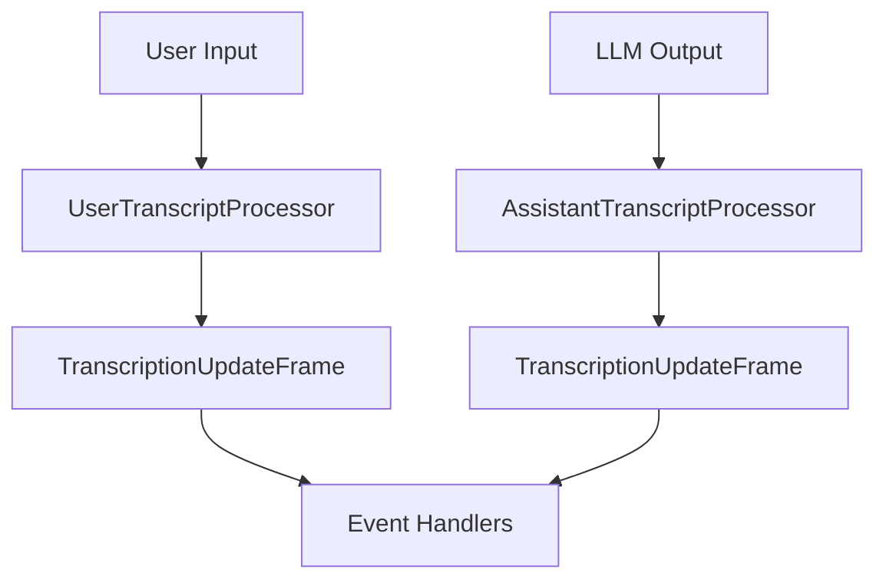

## Overview

`TranscriptProcessor` is a factory that creates and manages processors for handling conversation transcripts from both users and assistants. It provides unified access to transcript processors with shared event handling, making it easy to track and respond to conversation updates in real-time.

The processor normalizes messages from various LLM services (OpenAI, Anthropic, Google) into a consistent format and emits events when new messages are added to the conversation.

<Tip>
  Check out the transcript processor examples for
  [OpenAI](https://github.com/pipecat-ai/pipecat/blob/main/examples/foundational/28a-transcription-processor-openai.py),
  [Anthropic](https://github.com/pipecat-ai/pipecat/blob/main/examples/foundational/28b-transcript-processor-anthropic.py),
  and [Google
  Gemini](https://github.com/pipecat-ai/pipecat/blob/main/examples/foundational/28c-transcription-processor-gemini.py)
  to see it in action.
</Tip>

## Factory Methods

<ParamField path="user" type="method">
  Creates/returns a UserTranscriptProcessor instance that handles user messages
</ParamField>

<ParamField path="assistant" type="method">
  Creates/returns an AssistantTranscriptProcessor instance that handles
  assistant messages
</ParamField>

<ParamField path="event_handler" type="decorator">
  Registers event handlers that will be applied to both processors
</ParamField>

## Events

<ParamField path="on_transcript_update" type="event">
  Emitted when new messages are added to the conversation transcript. Handler
  receives: - processor: The TranscriptProcessor instance - frame:
  TranscriptionUpdateFrame containing new messages
</ParamField>

## Transcription Messages

Transcription messages are normalized to this format:

```python
@dataclass
class TranscriptionMessage:
    role: Literal["user", "assistant"]  # Type of message sender
    content: str                        # Transcription message
    timestamp: str | None = None        # Message timestamp
```

## Pipeline Integration

The TranscriptProcessor is designed to be used in a pipeline to process conversation transcripts in real-time. In the pipeline:

- The UserTranscriptProcessor (`transcript.user()`) handles TranscriptionFrames from the STT service
- The AssistantTranscriptProcessor (`transcript.assistant()`) handles TextFrames from the LLM service

Ensure that the processors are placed after their respective services in the pipeline. See the Basic Usage example below for more details.

## Usage Examples

### Basic Usage

This example shows the basic usage for the TranscriptProcessor factory.

```python
transcript = TranscriptProcessor()

pipeline = Pipeline([
    transport.input(),
    stt,
    transcript.user(),              # Process user messages
    context_aggregator.user(),
    llm,
    tts,
    transport.output(),
    context_aggregator.assistant(),
    transcript.assistant(),         # Process assistant messages
])

# Register event handler for transcript updates
@transcript.event_handler("on_transcript_update")
async def handle_update(processor, frame):
    for msg in frame.messages:
        print(f"{msg.role}: {msg.content}")
```

### Maintaining Conversation History

This example extends the basic usage example by showing how to create a custom handler to maintain conversation history and log new messages with timestamps.

```python
class TranscriptHandler:
    def __init__(self):
        self.messages = []

    async def on_transcript_update(self, processor, frame):
        self.messages.extend(frame.messages)

        # Log new messages with timestamps
        for msg in frame.messages:
            timestamp = f"[{msg.timestamp}] " if msg.timestamp else ""
            print(f"{timestamp}{msg.role}: {msg.content}")

transcript = TranscriptProcessor()
handler = TranscriptHandler()

@transcript.event_handler("on_transcript_update")
async def on_update(processor, frame):
    await handler.on_transcript_update(processor, frame)
```

### Frame Flow



## Notes

- Supports multiple LLM services (OpenAI, Anthropic, Google)
- Normalizes message formats from different services
- Maintains conversation history with timestamps
- Emits events for real-time transcript updates
- Thread-safe for concurrent processing
